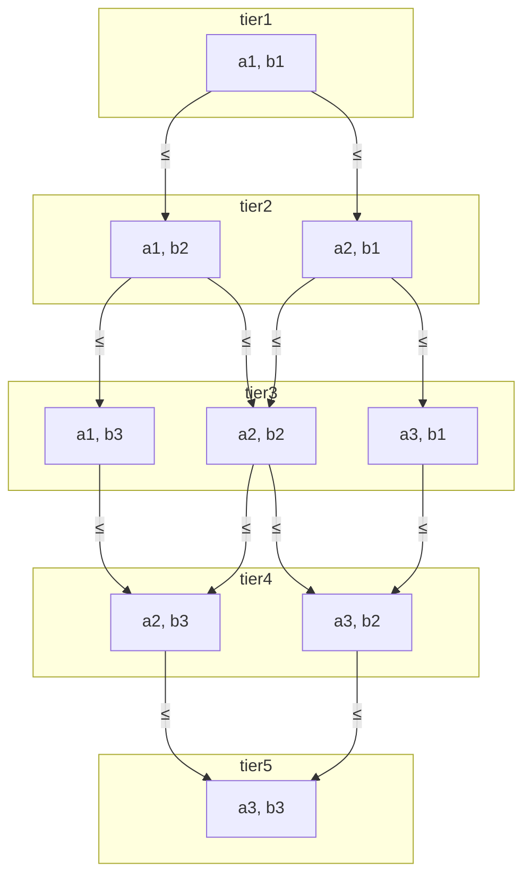

# Decision Points are Ordered Sets

## Context and Problem Statement

Decision Points are collections of values that can be used to construct an SSVC Decision Model (aka Tree).
We would like to be able to consistently reason about outcomes of a decision given a set of input values.
Doing so may allow us to automate portions of decision model construction and evaluation by asserting
rules about the interaction between decision point values and the outcomes of the decision.

## Decision Drivers

* The need to reason about the outcomes of a decision given a set of input values.
* Desire to automate portions of the decision-making process.
* Desire for rules to validate the interaction between decision point values and the outcomes of the decision.

## Considered Options

* Decision Point values are ordered sets.
* Decision Point values are unordered sets.

## Decision Outcome

Chosen option: "Decision Point values are ordered sets"

Rationale: An ordered set implies that for a decision set $D$ with $n$ values $d_1, d_2, \ldots, d_n$, we can
assert the relationship $d_1 \leq d_2 \leq \ldots \leq d_n$. 

When combining decision points into a decision model, we can use that relationship to assert rules about the
interaction between decision points. For example, if we have a decision point $D_a$ with values $a_1, a_2, a_3$
and a decision point $D_b$ with values $b_1, b_2, b_3$, we know that 

- $a_1 \leq a_2 \leq a_3$
- $b_1 \leq b_2 \leq b_3$

We can then extend this reasoning to assert the following relationships in combination:

(Note that in the following diagram, lower values are at the top and higher values are at the bottom.)

In the above diagram, the pairs of values in a tier are incomparable (we don't know which is greater). However, we
can assert that the pairs in the next tier are greater than or equal to the pairs in the previous tier. This
relationship is only possible because we have ordered sets.

Note that while from the above we can assert that
$(a1,b3) \geq (a1,b2) \geq (a1,b1)$
and
$(a3,b1) \geq (a2,b1) \geq (a1,b1)$,
we cannot assert that $(a1,b3) \geq (a2,b1)$ or $(a3,b1) \geq (a1,b2)$. The only relationships we can assert are
those that are directly implied by the ordered set relationship (i.e., those shown as arrows in the diagram).

In combination with an ordered outcome set, then we can say that the outcome of a decision value must be
equal to or between the outcomes of the decision values above and below it. This allows us to generate
default policies that map decision values to outcomes following the graph structure of the decision model.

### Consequences

* (Good) This allows us to make inferences about the relationships between sets of decision point values
  and the outcomes of the decision.
* (Neutral) Does not fully order all possible decision point value combinations, leaving some relationship combinations
  undefined.
* (Neutral) May require additional information to fully define the relationship between decision point values and outcomes
  into a policy
* (Neutral) Requires each decision point to have a "direction" (i.e., a way to order the values) which may not be
  intuitive in all cases. So far we have found that the natural direction is usually intuitive and most often it is
  analogous to "less likely to act" &rarr; "more likely to act". 
* (Good) Although a sense of direction is required, scaling the values is not. So "None, Few, Many" is just as valid as
  a more defined interval scale like "0-4, 4-7, 7-9, 9-10" or a more abstract scale like "Low, Medium, High, Critical"[^1].

[^1]: The latter two examples were inspired by CVSS scoring.

### Confirmation

All current decision points are constructed as ordered sets, and the current policy generator tool makes use of that
ordering assumption to generate policies from a set of decision points and outcomes. This isn't so much a feature
we can test for, it's an axiom we use to reason about the decision model.

However, we *can* evaluate new decision points as they are proposed to ensure that they are ordered sets.

## More Information

- Discussion: [Are Decision Points always ordered sets?](https://github.com/CERTCC/SSVC/discussions/290)
- Issues: [#299](https://github.com/CERTCC/SSVC/issues/299), [#403](https://github.com/CERTCC/SSVC/issues/403)
- Relevant prior PRs: [#423](https://github.com/CERTCC/SSVC/pull/423), [#424](https://github.com/CERTCC/SSVC/pull/424)
- [ADR-0009](0009-outcomes-are-ordered-sets.md) - Outcomes are Ordered Sets
- [Partially ordered sets](https://en.wikipedia.org/wiki/Partially_ordered_set)
- [Hasse diagram](https://en.wikipedia.org/wiki/Hasse_diagram)

