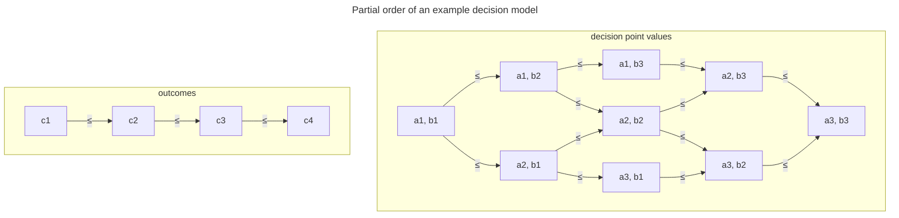
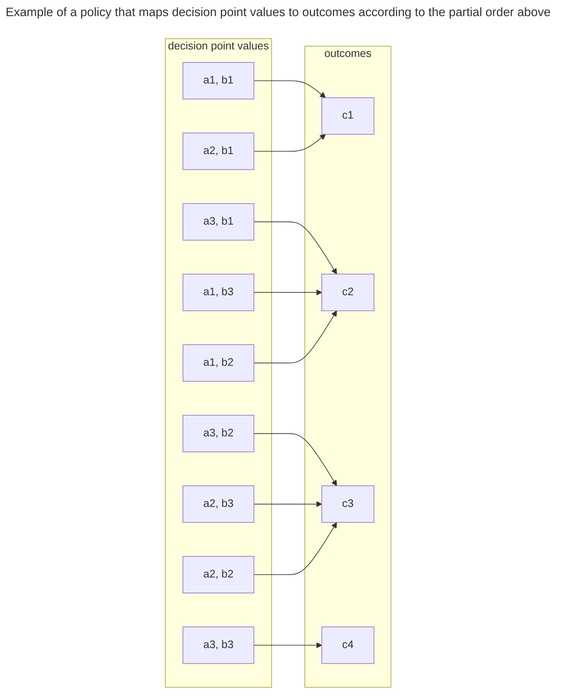

# Decision Points are Ordered Sets

## Context and Problem Statement

Outcome sets are collections of values that can be used to construct an SSVC Decision Model (aka Tree).
We would like to be able to consistently reason about outcomes of a decision given a set of input values.
Doing so may allow us to automate portions of decision model construction and evaluation by asserting
rules about the interaction between decision point values and the outcomes of the decision.

## Decision Drivers

- The need to reason about the outcomes of a decision given a set of input values.
- Desire to automate portions of the decision-making process.
- Desire for rules to validate the interaction between decision point values and the outcomes of the decision.

## Considered Options

- Outcome values are ordered sets.
- Outcome values are unordered sets.

## Decision Outcome

Chosen option: "Outcome values are ordered sets"

Rationale: An ordered set implies that for an outcome set $C$ with $n$ values $c_1, c_2, \ldots, c_n$, we can
assert the relationship $c_1 \leq c_2 \leq \ldots \leq c_n$.

When combining outcomes with a set of decision points into a decision model and policy, we can use that relationship
to assert rules about the resulting policy.

For example, if we have a decision model consisting of:

- a decision point $D_a$ with values $a_1, a_2, a_3$ which follows the relationship $a_1 \leq a_2 \leq a_3$
- a decision point $D_b$ with values $b_1, b_2, b_3$ which follows the relationship $b_1 \leq b_2 \leq b_3$
- an outcome set $C$ with values $c_1, c_2, c_3, c_4$ which follows the relationship $c_1 \leq c_2 \leq c_3 \leq c_4$

We know the following relationships to be true:

(Note that in the following diagram, lower values are at the top and higher values are at the bottom.)

And so we can evaluate the validity of a specific policy such as:

This generalizes to the following:

Given a specific tuple of decision point values $T_1 = (a_i, b_j, \ldots)$ and a second tuple
of decision point values $T_2 = (a_k, b_l, \ldots)$ where $T_1 \leq T_2$, then the outcome of the decision
$Outcome(T_1)$ must be equal to or less than the outcome $Outcome(T_2)$ of any tuple of decision point values $T_2$.

$Outcome(T_1) \leq Outcome(T_2)$ when $T_1 \leq T_2$.

This allows us to generate default policies that map decision values to outcomes following the graph structure of the
decision model.

### Consequences

- (Good) This allows us to make inferences about the relationships between sets of decision point values
  and the outcomes of the decision.
- (Neutral) Does not fully order all possible decision point value combinations, leaving some relationship combinations
  undefined.
- (Neutral) May require additional information to fully define the relationship between decision point values and outcomes
  into a policy
- (Neutral) Requires each outcome set to have a "direction" (i.e., a way to order the values) which may not be
  intuitive in all cases. So far we have found that the natural direction is usually intuitive and most often it is
  analogous to "less likely to act" &rarr; "more likely to act".
- (Good) Although a sense of direction is required, scaling the values is not. So "Defer, Scheduled, Out-of-Band, Immediate"
  is just as valid as a more Service Level Expectation (SLE) oriented "1 hour, 1 day, 1 week, 1 month".

### Confirmation

All current outcomes are constructed as ordered sets, and the current policy generator tool makes use of that
ordering assumption to generate policies from a set of decision points and outcomes. This isn't so much a feature
we can test for, it's an axiom we use to reason about the decision model.

However, we *can* evaluate new outcome sets as they are proposed to ensure that they are ordered sets.

## More Information

- Discussion: [Are Decision Points always ordered sets?](https://github.com/CERTCC/SSVC/discussions/290)
- Issues: [#299](https://github.com/CERTCC/SSVC/issues/299), [#403](https://github.com/CERTCC/SSVC/issues/403)
- Relevant prior PRs: [#423](https://github.com/CERTCC/SSVC/pull/423), [#424](https://github.com/CERTCC/SSVC/pull/424)
- [ADR-0008](0008-decision-points-are-ordered-sets.md) - Decision Points are Ordered Sets
- [Partially ordered sets](https://en.wikipedia.org/wiki/Partially_ordered_set)
- [Hasse diagram](https://en.wikipedia.org/wiki/Hasse_diagram)
