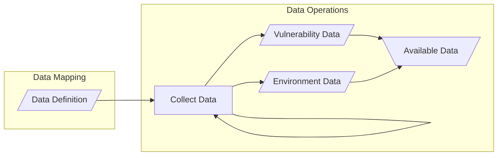

# Data Operations

!!! note inline end

      The diagram below shows two kinds of data emanating from the Data Operations process: _Vulnerability Data_ and _Environment Data_.
      Vulnerability Data is data about the vulnerability itself, such as the technical impact or exploit availability.
      Environment Data is data about the environment in which the vulnerable systems exist, such as network topology or system criticality.
      We generally expect that Environment Data will be more stable than Vulnerability Data, but that is not always the case.

While the actual collection of operational data is outside the scope of SSVC, it is an important part of any implementation
of the process.
SSVC is designed to be flexible enough to accommodate a variety of data collection methods.
The [Data Mapping](prepare.md) step defines the data that is needed to assign a value to each decision point.
The Data Operations process collects that data so that it can be used to assign values to decision points in the
[Use SSVC](use.md) step.

We include a feedback loop on the data collection node to indicate that it is expected to be a continuous process.

!!! example

     Having defined a data map that translates certain values from specific threat feeds to the _Exploitation_ decision 
     point values _PoC_ or _Active_, an organization maintains a subscription to those threat feeds and collects the 
     data from them on a continuous basis. 
     They also write a script that parses the data from the threat feeds and applies the data map to assign a value to 
     the _Exploitation_ decision point.

## Guidance for Evidence Gathering

To answer each of these decision points, a stakeholder should, as much as possible, have a repeatable evidence
collection and evaluation process.
However, we are proposing decisions for humans to make, so evidence collection and evaluation is not totally automatable.
That caveat notwithstanding, some automation is possible.

!!! example "Evidence of Exploitation"

    For example, whether exploitation modules are available in ExploitDB, Metasploit, or other sources is straightforward.
    We hypothesize that searching Github and Pastebin for exploit code can be captured in a script.
    A supplier or deployer could then define [*Exploitation*](../../reference/decision_points/exploitation.md) to take the value of [*PoC*](../../reference/decision_points/exploitation.md) if
    there are positive search results for a set of inputs derived from the CVE entry in at least one of these venues.
    At least, for those vulnerabilities that are not “automatically” PoC-ready, such as on-path attackers for TLS or network
    replays.

Some of the decision points require a substantial upfront analysis effort to gather risk assessment or organizational
data.
However, once gathered, this information can be efficiently reused across many vulnerabilities and only refreshed
occasionally.

!!! example "Evidence of Mission Impact"

    An obvious example of this is the [Mission Impact](../../reference/decision_points/mission_impact.md) decision point.
    To answer this, a deployer must analyze their Mission Essential Functions (MEFs), how they interrelate, and how they are supported.

!!! example "Evidence of System Exposure"

    [System Exposure](../../reference/decision_points/system_exposure.md) is similar; answering that decision point requires an asset inventory, adequate understanding of the network
    topology, and a view of the enforced security controls.
    Independently operated scans, such as Shodan or Shadowserver, may play a role in evaluating exposure, but the entire
    exposure question cannot be reduced to a binary question of whether an organization’s assets appear in such databases.

Once the deployer has the situational awareness to understand their Mission Essential Functions or System Exposure, selecting the answer for each individual
vulnerability is usually straightforward.

Stakeholders who use the prioritization method should consider releasing the priority with which they handled the
vulnerability.
This disclosure has various benefits.
For example, if the supplier publishes a priority ranking, then deployers could consider that in their decision-making
process.
One reasonable way to include it is to break ties for the deployer.
If a deployer has three “scheduled” vulnerabilities to remediate, they may address them in any order.
If two vulnerabilities were produced by the supplier as “scheduled” patches, and one was “out-of-cycle,” then the
deployer may want to use that information to favor the latter.

### Suggested Default Values

In the case where no information is available or the organization has not yet matured its initial situational analysis,
we can suggest something like defaults for some decision points.











!!! example "Using Defaults"

    Applying these defaults to the [deployer decision model](../deployer_tree.md)

    - *Exploitation*: none
    - *System Exposure*: open
    - *Automatable*: yes
    - *Human Impact*: medium (combination of Safety and Mission Impacts)
        - *Safety Impact*: marginal
        - *Mission Impact*: support crippled

    results in a `scheduled` patch application.
