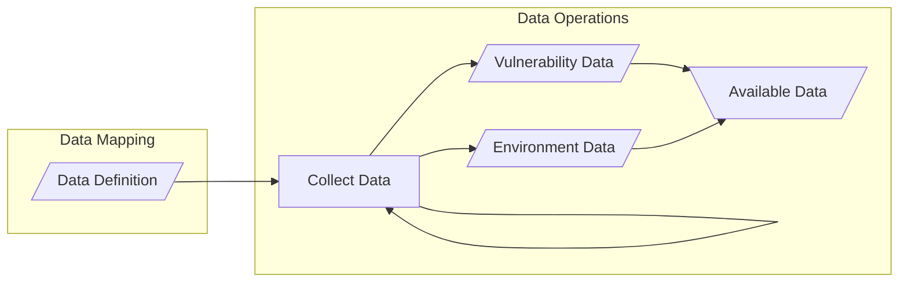

# Data Operations

!!! note inline end

      The diagram below shows two kinds of data emanating from the Data Operations process: _Vulnerability Data_ and _Environment Data_.
      Vulnerability Data is data about the vulnerability itself, such as the technical impact or exploit availability.
      Environment Data is data about the environment in which the vulnerable systems exist, such as network topology or system criticality.
      We generally expect that Environment Data will be more stable than Vulnerability Data, but that is not always the case.

While the actual collection of operational data is outside the scope of SSVC, it is an important part of any implementation
of the process.
SSVC is designed to be flexible enough to accommodate a variety of data collection methods.
The [Data Mapping](prepare.md#data-mapping) step defines the data that is needed to assign a value to each decision point.
The Data Operations process collects that data so that it can be used to assign values to decision points in the 
[Use SSVC](use.md) step.

We include a feedback loop on the data collection node to indicate that it is expected to be a continuous process. 

!!! example

     Having defined a data map that translates certain values from specific threat feeds to the _Exploitation_ decision 
     point values _PoC_ or _Active_, an organization maintains a subscription to those threat feeds and collects the 
     data from them on a continuous basis. 
     They also write a script that parses the data from the threat feeds and applies the data map to assign a value to 
     the _Exploitation_ decision point.


