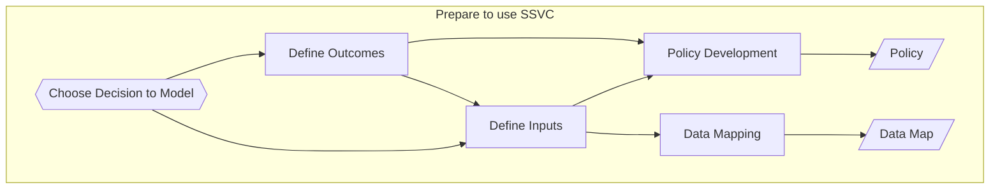
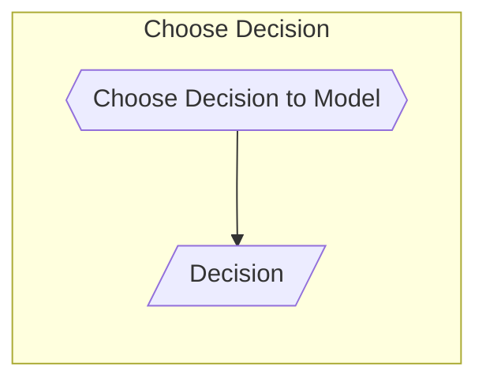
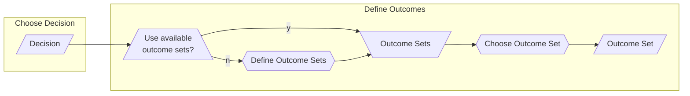
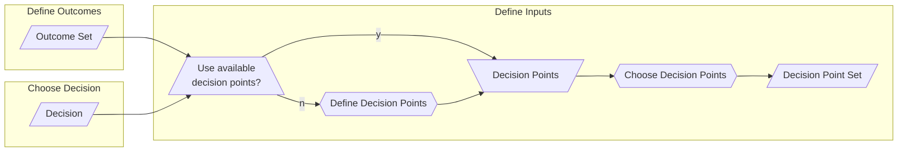
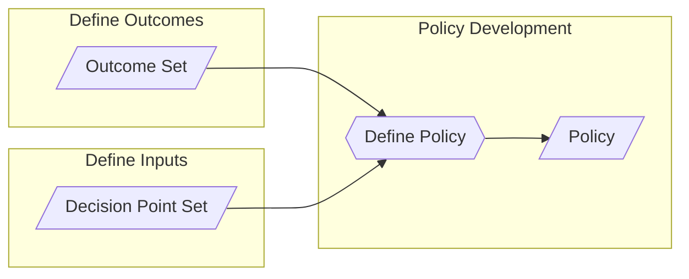
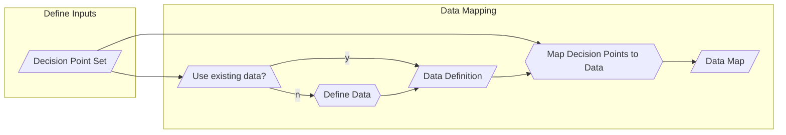

# Prepare to Use SSVC

Preparing to use SSVC involves defining a decision you want to make,
the information you need to make that decision, and the policy you want to use to make that decision.

Here is a diagram of the preparation process:

We will go through each step in detail.

## Choose a Decision to Model

!!! example inline end
    
    Decisions we have modeled with SSVC include:
   
    - [Patch Supplier Prioritization](supplier_tree.md)
    - [Patch Deployer Prioritization](deployer_tree.md)
    - [Coordinator Triage](coordinator_trees.md)
    - [Coordinator Publication](coordinator_publish_tree.md)

The first step in preparing to use SSVC is to choose a decision to model.
SSVC is designed to help you make decisions about how to respond to a vulnerability.
In the SSVC documentation, we provide a number of example decisions that you might want to make.
You can use one of these decisions, or you can define your own decision.

<!-- for vertical spacing -->
 

## Define Outcomes

!!! example inline end

     In the [Patch Supplier](supplier_tree.md) and [Patch Deployer](deployer_tree) prioritization examples, the outcomes are:
     _Defer_, _Scheduled_, _Out-of-Cycle_, and _Immediate_. In the [Coordinator Triage](coordinator_trees.md) example,
     the outcomes are _Coordinate_, _Track_, and _Decline_. In the [Coordinator Publication](coordinator_publish_tree.md) example,
     the outcomes are _Publish_ and _Do Not Publish_.

Once you have chosen a decision to model, you need to define the outcomes for that decision.
An outcome is the result of making a decision.
Outcomes are often tailored specifically to the stakeholder context in which the decision is being made.
We call the set of possible outcomes for a decision an outcome set.

We have provided a number of example outcome sets in the SSVC documentation, but you can define your own outcome set to meet your needs.

!!! example 

     Imagine two different Service Providers, each of which is responsible for managing vulnerabilities in their
     respective environments.
     One Service Provider might use a 5-tier incident response model, and so might define their outcome set as:
     _Severity 1_, _Severity 2_, _Severity 3_, _Severity 4_, and _Severity 5_.
     Another Service Provider might only have three tiers, and so might define their outcome set as:
     _High_, _Medium_, and _Low_.
     So even though both Service Providers are making the same prioritization decision about their response to the same,
     vulnerability, they can use different outcome sets.

## Define Inputs

Once you know what decision you want to make and what the possible outcomes are, you need to define the information you need to make that decision.
A decision usually requires more than one piece of information.
SSVC organizes this information into decision points.
A single decision point enumerates a set of options for a particular aspect of the decision.
We have defined a number of decision points in the [SSVC documentation](../reference/decision_points/index.md).
You can choose from these decision points, or you can define your own decision points to meet your needs.

Whether you choose from the existing decision points or define your own, the set of decision points you use to make a 
decision is called a Decision Point Set.

!!! example

     A medical device manufacturer has specific regulatory requirements for how they respond to vulnerabilities.
     As an organization, they have divided their product line into three categories: regulated devices, non-regulated devices, and support services.
     Vulnerability reports for regulated devices are handled differently than vulnerability reports for 
     non-regulated devices. Also, vulnerability reports for support services are handled differently than vulnerability
     reports for devices of any kind because support services are covered by medical privacy regulations in addition to
     device safety regulations. So, the medical device manufacturer might define a decision point called _Regulated_ with
     the values _Regulated Device_, _Non-Regulated Device_, and _Support Service_.

## Define Policy

So far, you have chosen a decision to model, defined the possible outcomes for that decision, and defined the information you need to make that decision.
Now, you need to define the policy you want to use to make that decision.
A policy is a function that takes a set of decision point values as input and returns an outcome as output.
While we often choose to represent policies as decision trees, they can be represented in other ways as well.
In fact, we find that it is often useful to represent policies in tabular form, for example as a CSV file.
We have provided a number of example policies in the [SSVC documentation](../prioritization.md), but you can define your own policy to meet your needs.

!!! example

     A small bank has a policy that they must deploy patches within 48 hours of release if the vulnerability affects systems
     that could lead to customer data being exposed. They examine the example [Deployer Prioritization](supplier_tree.md)
     decision model and decide that both the outcome set and the decision point set that define the structure of the
     decision model are appropriate for their needs. They map the 48 hour requirement to the _Immediate_ outcome, because
     it essentially represents their highest priority response.
     However, they notice that the specific policy given in the [Deployer Prioritization](supplier_tree.md)
     example&mdash;that is, the mapping from decision point values to outcomes&mdash;is not appropriate for their needs
     because it has too few _Immediate_ outcomes to suit their policy.
     Therefore, the bank decides to reuse the same decision point set and outcome set but define their own policy.
     
## Data Mapping

In SSVC, data mapping is the process of defining what data can be used to assign a value to each decision point.
The resulting data map indicates which data sources are relevant to each decision point, and how to interpret the data
from each data source to assign a value to the decision point.

!!! example

    A Software-as-a-Service Provider differentiates its service levels into three categories: silver, gold, and platinum.
    In the [Define Inputs](#define-inputs) step, they defined a custom decision point called _Service Level_ with the values
    _Silver_, _Gold_, and _Platinum_.
    Now, they need to define a data map that will assign a value to the _Service Level_ decision point.
    The data they need to assign a value to the _Service Level_ decision point originates in the service level
    agreement (SLA) for each service. 
    These SLAs are stored in a database.
    They decide to write a script that will query the database for the SLA for each service and assign a value to the
    _Service Level_ decision point based on the SLA.
    As these SLAs do not change very often, they decide to run the script once a day and store the results in a file.
    They define a data map that indicates that the data source for the _Service Level_ decision point is the file 
    containing the SLA data, and document that the script they wrote will assign a value to the _Service Level_ decision
    point based on the SLA data.
