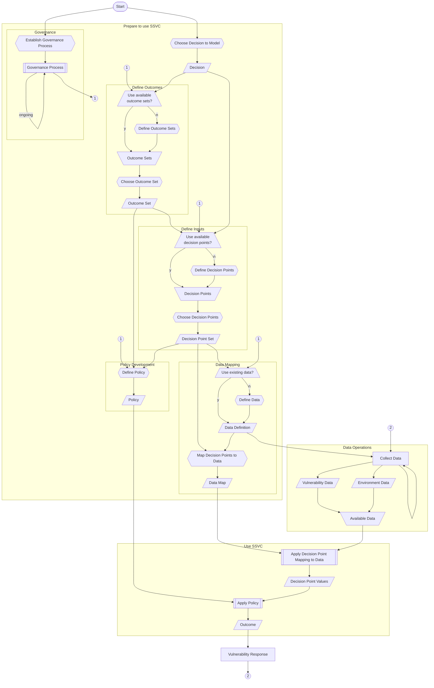

# Bootstrapping SSVC Summary

Using SSVC to prioritize vulnerability response requires a few steps. The steps are:



We covered each of these in the previous sections, see the links in the table above for more information.

The diagram below shows the complete process of using SSVC.

