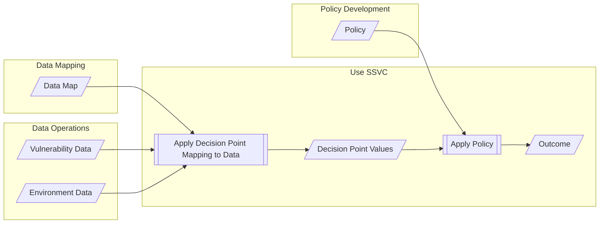
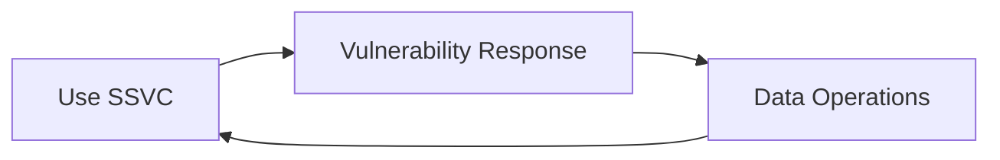

# Use SSVC

The [preparation](prepare.md) is complete, data is being [collected](collect.md), and now it is time to use
SSVC to make decisions about how to [respond to vulnerabilities](#respond-to-vulnerabilities).

!!! example
    
    A government agency has a need to prioritize vulnerability response as part of their vulnerability management process.
    Certain vulnerabilities require special handling as a matter of government policy, and the agency wants to make sure
    that they are not overlooked.

    The agency completed the [preparation steps](prepare.md) and has defined the decision, the outcome set, and the
    decision points and values they want to use.
    Because of some special requirements for government agencies, they chose to use a custom outcome set that more closely
    matches their existing process.
    These same requirements also led them to define a decision function based on a custom selection of existing decision
    points.
    They've mapped their agency policy to a decision policy that assigns specific decision point values to specific outcomes.
    They have also enumerated the data they need to inform the relevant decision point values.
    The agency has a process for collecting the data they need, and they have collected the data for a particular
    vulnerability. 
    Now they are ready to use SSVC to decide how to respond to a vulnerability.

    Taking the data they have collected, they first combine it with the data map to produce a set of decision point values.
    Then they apply the policy to the decision point values to produce an outcome.
    The outcome is a prioritization decision that they can use to inform their response to the vulnerability.

## Respond to Vulnerabilities

The actual response to vulnerabilities is outside the scope of SSVC.
But since SSVC is intended to support the vulnerability response process, we include a node to indicate that the
vulnerability response process is the ultimate consumer of the prioritization decision.
We also include a feedback loop from the response node to the data operations node to indicate that the response
process may generate new data that can be used to inform future prioritization decisions.

!!! example

    Different organizations will have different vulnerability response processes.
    The government agency in the previous example might need to notify system owners of the vulnerability and
    track other information about the vulnerability for reporting and auditing purposes.
    The service providers in previous examples might need to notify customers of the vulnerability and schedule
    maintenance windows to apply patches.
    Medical device manufacturers might need to develop patches, notify regulators of the vulnerability, and provide 
    instructions to hospital users for applying patches.
    SSVC does not prescribe any particular response process, but it does provide a structured way to make decisions 
    within the response process.