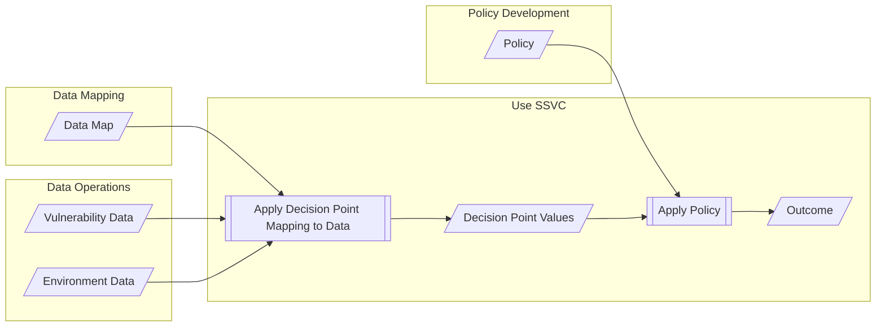
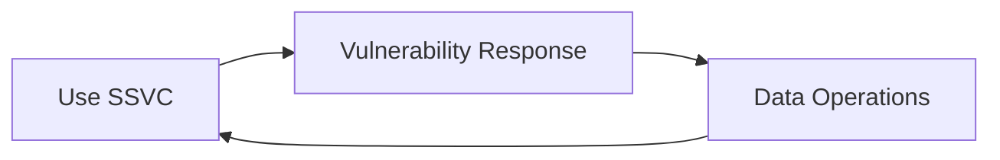

# Use SSVC

The [preparation](prepare.md) is complete, data has been [collected](collect.md), and now it is time to use
SSVC to make decisions about how to respond to vulnerabilities.



!!! example

    A government agency has a need to prioritize vulnerability response as part of their vulnerability management process.
    Certain vulnerabilities require special handling as a matter of government policy, and the agency wants to make sure
    that they are not overlooked.

    The agency completed the [preparation steps](prepare.md) and has defined the decision, the outcome set, and the
    decision points and values they want to use.
    Because of some special requirements for government agencies, they chose to use a custom outcome set that more closely
    matches their existing process.
    These same requirements also led them to define a decision function based on a custom selection of existing decision
    points.
    They've mapped their agency policy to a decision policy that assigns specific decision point values to specific outcomes.
    They have also enumerated the data they need to inform the relevant decision point values.
    The agency has a process for collecting the data they need, and they have collected the data for a particular
    vulnerability. 
    Now they are ready to use SSVC to decide how to respond to a vulnerability.

    Taking the data they have collected, they first combine it with the data map to produce a set of decision point values.
    Then they apply the policy to the decision point values to produce an outcome.
    The outcome is a prioritization decision that they can use to inform their response to the vulnerability.

## Respond to Vulnerabilities

The actual response to vulnerabilities is outside the scope of SSVC.
But since SSVC is intended to support the vulnerability response process, we include a node to indicate that the
vulnerability response process is the ultimate consumer of the prioritization decision.
We also include a feedback loop from the response node to the data operations node to indicate that the response
process may generate new data that can be used to inform future prioritization decisions.



!!! example

    Different organizations will have different vulnerability response processes.
    The government agency in the previous example might need to notify system owners of the vulnerability and
    track other information about the vulnerability for reporting and auditing purposes.
    The service providers in previous examples might need to notify customers of the vulnerability and schedule
    maintenance windows to apply patches.
    Medical device manufacturers might need to develop patches, notify regulators of the vulnerability, and provide 
    instructions to deployers (e.g., device maintainers at hospitals) for applying patches.
    SSVC does not prescribe any particular response process, but it does provide a structured way to make decisions 
    within the response process.

## Guidance on Communicating Results

There are many aspects of SSVC that two parties might want to communicate.
Not every stakeholder will use the decision points to make comparable decisions.
[Suppliers](../supplier_tree.md) and [deployers](../deployer_tree.md) make interdependent decisions, but the actions of one group are not strictly dependent on the other.
Recall that one reason for this is that SSVC is about prioritizing a vulnerability response action in general, not specifically applying a patch that a supplier produced.
[Coordinators](../coordination_intro.md) are particularly interested in facilitating communication because that is their core function.
This section handles three aspects of this challenge:

- formats for communicating SSVC
- how to handle partial or incomplete information
- and how to handle information that may change over time

This section is about communicating SSVC information about a specific vulnerability.
Any stakeholder making a decision on allocating effort should have a decision tree model its decision points and possible outcome values specified already.
[Representation choices](../../topics/decision_trees.md) and [Tree Construction and Customization Guidance](../tree_customization.md) discussed how SSVC uses a text file as the canonical form of a decision tree; the example trees can be found in [SSVC/data](https://github.com/CERTCC/SSVC/tree/main/data).
This section discusses the situation where one stakeholder, usually a supplier or coordinator, wants to communicate some information about a specific vulnerability to other stakeholders or constituents.

### JSON Format

We provide a structured communication format for SSVC information using JSON schemas.
The goal of this format is to capture all the context and details about a decision or work item in a clear and machine-readable way.

- The [provision schema](https://github.com/CERTCC/SSVC/blob/main/data/schema/SSVC_Provision.schema.json) is equivalent to a decision model and documents the full set of logical statements that a
stakeholder uses to make decisions.
- The [computed schema](https://github.com/CERTCC/SSVC/blob/main/data/schema/SSVC_Computed.schema.json) expresses a set of information about a work item or vulnerability at a point in time.
A computed schema should identify the provision schema used, so the options from which the information was computed are specified.

!!! info "Deriving a Decision Point JSON key-value pair"

    Each element of `choices` should be an object that is a key-value pair of `decision point`:`value`, 
    where the term `decision point` is a string derived from the name of the decision point as follows:

    - Start with the decision point name as given in [Likely Decision Points and Relevant Data](../../reference/decision_points/index.md).
    - Remove any text in parentheses (and the parentheses themselves).
    - Remove colon characters, if any (`:`).
    - Convert the string to [lower camel case](https://en.wikipedia.org/wiki/Camel_case) by lowercasing the string, capitalizing any letter after a space, and removing all spaces.

    The `value` term is derived the same way as `decision point` except start with the value name as given in the relevant decision point subsection of [Likely Decision Points and Relevant Data](../../reference/decision_points/index.md).

### Partial or Incomplete Information

What an analyst knows about a vulnerability may not be complete.
However, the vulnerability management community may still benefit from partial information.
In particular, suppliers and coordinators who might not know everything a deployer knows can still provide benefit to deployers by sharing what partial information they do know.
A second benefit to providing methods for communicating partial information is the reduction of bottlenecks or barriers to information exchange.
A timely partial warning is better than a complete warning that is too late.

The basic guidance is that the analyst should communicate all of the vulnerability's possible states, to the best of the analyst's knowledge.
If the analyst knows nothing, all states are possible.

!!! example "Communicating All Possible States"

    For example, [Utility](../../reference/decision_points/utility.md) may be [laborious](../../reference/decision_points/utility.md), [efficient](../../reference/decision_points/utility.md), or [super effective](../../reference/decision_points/system_exposure.md).

    ```python exec="true" idprefix=""
    from ssvc.decision_points.utility import LATEST
    from ssvc.doc_helpers import example_block
    
    print(example_block(LATEST))
    ```

    The reason a stakeholder might publish a decision point with all its possible values is that doing so expresses that the analyst thought about [*Utility*](#utility) but does not have anything to communicate.
    A stakeholder might have information to communicate about some decision points but not others.
    If SSVC uses this format to list the values that are in play for a particular vulnerability, there is no need for a special “I don't know” marker.

The merit in this “list all values” approach emerges when the stakeholder knows that the value for a decision point may be A or B, but not C.

!!! example "When Some Values Are Known (But Others Are Not)"

    Extending the previous example, say the analyst knows that [*Value Density*](../../reference/decision_points/value_density.md) is [diffuse](../../reference/decision_points/value_density.md) but does not know the value for [Automatability](../../reference/decision_points/automatable.md).

    ```python exec="true" idprefix=""
    from ssvc.decision_points.value_density import LATEST
    from ssvc.doc_helpers import example_block

    print(example_block(LATEST))
    ```

    ```python exec="true" idprefix=""
    from ssvc.decision_points.automatable import LATEST
    from ssvc.doc_helpers import example_block

    print(example_block(LATEST))
    ```

    Therefore they could rule out [super effective](../../reference/decision_points/utility.md) 
    for [Utility](../../reference/decision_points/utility.md)
    but not [laborious](../../reference/decision_points/utility.md)
    or [efficient](../../reference/decision_points/utility.md).
    In this case, the analyst could usefully restrict [Utility](../../reference/decision_points/utility.md) to one of [laborious](../../reference/decision_points/utility.md) or [efficient](../../reference/decision_points/utility.md)
    while leaving [Automatability](../../reference/decision_points/automatable.md) open.

As discussed below, information can change over time.
Partial information may be, but is not required to be, sharpened over time into a precise value for the decision point.

## Information Changes Over Time

Vulnerability management decisions are dynamic, and may change over time as the available information changes.
Information changes are one reason why SSVC decisions should always be timestamped.
SSVC decision points have different temporal properties.
Some, such as [Utility](../../reference/decision_points/utility.md), are mostly static.
For [Utility](../../reference/decision_points/utility.md) to change, the market penetration or deployment norms of a vulnerable component would have to meaningfully change.
Some, such as [Exploitation](../../reference/decision_points/exploitation.md), may change quickly but only in one direction.

!!! tip inline end "Focus on Automation"

    We expect that updating information over time will be most useful where the evidence-gathering process can be automated.
    Organizations that have mature asset management systems will also find this update process more efficient than those that do not.
    For an organization without a mature asset management system, we would recommend putting organizational resources into maturing that function before putting effort into regular updates to vulnerability prioritization decision points.

Both of these examples are out of the direct control of the vulnerability manager.
Some, such as [System Exposure](../../reference/decision_points/system_exposure.md), change mostly due to actions taken by the organization managing the vulnerable component.
If the actor who can usually trigger a relevant change is the organization using SSVC, then it is relatively straightforward to know when to update the SSVC decision.
That is, the organization should re-evaluate the decision when they make a relevant change.
For those decision points that are about topics outside the control of the organization using SSVC, then the organization should occasionally poll their information sources for changes.
The cadence or rate of polls is different for each decision point, based on the expected rate of change.

### Decision Points Not Under Direct Control

The following decision points are usually out of the control of the organization running SSVC.
As an initial heuristic, we suggest the associated polling frequency for each.
These frequencies can be customized, as the update frequency is directly related to the organization's tolerance for the risk that the information is out of date.
As discussed in [Tree Construction and Customization Guidance](../tree_customization.md), risk tolerance is unique to each organization.
Risk tolerance and risk appetite are primarily reflected in the priority labels (that is, decisions) encoded in the SSVC decision tree, but information polling frequency is also a risk tolerance decision and each organization may choose different time values.

| Decision Point                                                                 | Suggested Polling Frequency |
|--------------------------------------------------------------------------------|-----------------------------|
| [*Exploitation*](../../reference/decision_points/exploitation.md)                 | every 1 day |
| [*Technical Impact*](../../reference/decision_points/technical_impact.md)         | never (should be static per vulnerability) |
| [*Utility*](../../reference/decision_points/utility.md)                           | every 6 months |
| [*Public Safety Impact*](../../reference/decision_points/public_safety_impact.md) | every 1 year |

### Decision Points Under Direct Control

The following decision points are usually in the control of the organization running SSVC and should be re-evaluated when a relevant change is made or during annual reviews of assets.

- [*Situated Safety Impact*](../../reference/decision_points/safety_impact.md)
- [*Mission Impact*](../../reference/decision_points/mission_impact.md)
- [*System Exposure*](../../reference/decision_points/system_exposure.md)

### Timestamping SSVC Information

If SSVC information is all timestamped appropriately (as discussed earlier in this section), then an analyst can compare the timestamp to the current date and determine whether information is considered stale.
The above rates are heuristic suggestions, and organizations may choose different ones.
Any public repository of vulnerability information should keep a change log of when values change for each decision point, for each vulnerability.
Vulnerability response analysts should keep such change logs as well.
Similar to logging practices recommended for incident response [@nist800-61r2], such practices make the process less error-prone and facilitate after-action reviews.
