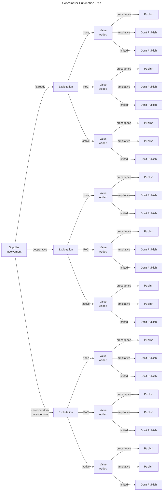

# Coordinator Publication Decision Tree

Suggested decision values for this decision are available in [CSV](../../data/csvs/ssvc_2_coord-publish.csv) and [PDF](../pdf/ssvc_2_coord-publish.pdf) formats.

<!-- 
<embed src="../../pdf/ssvc_2_coord-publish.pdf" alt="Suggested tree for a coordinator's publication decision" type="application/pdf"
style="width: 100%;"
height = "600" />
-->

## Table of Values

{{ read_csv('../../data/csvs/coord-publish-options.csv') }}

