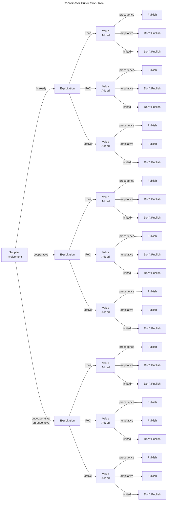

# Coordinator Publication Decision

Coordinators have to make two decisions about publication of information about a vulnerability.
The first is whether to coordinate the vulnerability, which we discuss in [Coordination Triage](coordination_triage_decision.md).
The second decision is whether to publish information about a vulnerability.
While other stakeholders may also have to make a publication decision, here we focus on the coordinator's decision.

!!! info "Coordinator Publication Decision"

    As noted in [Enumerating Decisions](../topics/enumerating_decisions.md), the root of a decision model's identity is
    the combination of the stakeholder and the decision being modeled. In this case, the stakeholder is the 
    **Coordinator** and the decision is **whether to publish an advisory about the vulnerability**.

## Policy Constraints and Publication Decisions

!!! tip inline end "Other Stakeholders' Publication Decisions"

    Other stakeholders may also have to make a publication decision.
    For example, a supplier may have to decide whether to publish information about a vulnerability in their product.
    A deployer may have to decide whether to publish information about a vulnerability in their infrastructure.
    A vulnerability finder may have to decide whether to publish information about a vulnerability they have discovered.
    Each of these decisions is likely to be different from the coordinator's decision.

The decision to publish information about a vulnerability is a policy choice, and is likely to differ from organization
to organization.
Two points where CERT/CC policy clearly influences the publication decision are embargo periods and scope.

### Publication and Embargo Periods

As a matter of policy, CERT/CC will support an embargo from the public of information about a vulnerability through its
choice not to publish that information while a number of conditions hold:

- A negotiated embargo timer has not expired. The CERT/CC default embargo period is [45 days](https://certcc.github.io/CERT-Guide-to-CVD/reference/certcc_disclosure_policy/).
- Other exceptions have not been met, including active exploitation of the vulnerability in the wild or other public
    discussion of the vulnerability details.

Regardless, the decision described in this section assumes the embargo period is over, one way or another.

### Triage Decisions and Publication

The second point is related to the [Coordination Triage Decision](coordination_triage_decision.md) and the status of the vulnerability.
CERT/CC only expects to publish about vulnerabilities with a [*coordinate*](coordination_triage_decision.md) status.
While an issue that is tracked or declined may be reevaluated at a later date and status changed to [*coordinate*](coordination_triage_decision.md),
unless that happens we would not publish about the vulnerability.
Other organizations, such as [NVD](https://nvd.nist.gov/), would have different publication criteria and may want to include decision
points or the decision itself from the [Coordination Triage Decision](coordination_triage_decision.md) in their publication decision.

## Coordinator Publication Units of Work

!!! info inline end "Coordinator Publication Unit of Work"

    The unit of work for the coordinator publication decision a single publication.
    For CERT/CC, this corresponds to a CERT Vulnerability Note.

In the CERT/CC's vulnerability coordination practice, a single report leads to a single coordination case which leads to a
single publication. Therefore the unit of work for the publication decision is often the same as the unit of work for the
[coordination triage decision](coordination_triage_decision.md).

That is sometimes not the case, however. For example, there could be multiple reports of multiple vulnerabilities and
the coordinator might choose to publish a single advisory covering all of them if the vulnerabilities are variations on
a central theme and have a common set of affected products.

!!! example "Multiple Reports, Single Advisory"

    There are numerous examples of multiple reported vulnerabilities being consolidated into a single publication
    in the CERT/CC's history. A few recent cases include:

    - [VU#132380](https://kb.cert.org/vuls/id/132380) _Vulnerabilities in EDK2 NetworkPkg IP stack implementation._
    - [VU#434994](https://kb.cert.org/vuls/id/434994) _Multiple race conditions due to TOCTOU flaws in various UEFI Implementations_
    - [VU#811862](https://kb.cert.org/vuls/id/811862) _Image files in UEFI can be abused to modify boot behavior_

Another possibility is that a single report could lead to multiple advisories, for example if
the product is a library that is used in multiple other products, and the coordinator chooses to publish separate advisories
based on some other criteria.

!!! example "Single Report, Multiple Advisories"

    Occasionally, a single report leads to multiple advisories. For example

    - [VU#854306](https://kb.cert.org/vuls/id/854306) _Multiple vulnerabilities in SNMPv1 request handling_
    - [VU#107186](https://kb.cert.org/vuls/id/107186) _Multiple vulnerabilities in SNMPv1 trap handling_

    arrived as a single report and were published as separate vulnerability notes
    because they affected different aspects of the libraries in question. Although this example pre-dates SSVC by 
    many years, it is illustrative of the situation where a single report leads to multiple advisories.

## Coordinator Publication Decision Outcomes

For the CERT/CC, the publication decision is binary: publish or do not publish.

!!! note "Coordinator Publish Priority"

    | Publish Priority | Description |
    | :---             | :----------  |
    | Do not publish   | Do not publish information about the vulnerability. |
    | Publish          | Publish information about the vulnerability. |

!!! tip "The Publication Decision is Time Sensitive"

    The publication decision is always a decision at a point in time.
    As discussed in [Guidance on Communicating Results](bootstrap/use.md), a SSVC decision may change over time as the inputs to that decision change.
    A decision to publish cannot be revoked, since the publication is likely to be archived or at least remembered.
    However, a decision to not publish is a decision not to publish at the time the decision was made.
    It is not a decision never to publish in the future.
    
    One benefit of encoding the decision process in SSVC is the analysts can all agree on what new information would change the decision and prioritize maintaining awarenss of just those decision points. 

!!! example "CERT/CC Publication Decision Outcomes Over Time"

    The CERT/CC has a [long history](https://vuls.cert.org/confluence/display/historical/CERT+Advisory+CA-1988-01+ftpd+Vulnerability)
    of publishing information about vulnerabilities.
    In the past, the CERT/CC had multiple publication vehicles, including
    [Vulnerability Notes](https://www.kb.cert.org/vuls),
    [CERT Advisories](https://vuls.cert.org/confluence/display/historical/CERT+Advisories), and 
    [Current Activity](https://web.archive.org/web/20040411195130/http://www.cert.org/current/archive/2003/12/29/archive.html)
    entries.
    Each of these had different publication criteria. Had we been using SSVC at the time, we might
    have modeled the publication decision differently for each of these vehicles. Or we might have modeled the decision as
    a single decision with multiple outcomes, each of which would lead to a different publication vehicle. This is an example
    of how SSVC can be customized to the needs of the organization using it.

## Coordinator Publication Decision Points

The publication decision reuses the [*Exploitation*](../reference/decision_points/exploitation.md) decision point
and adds two new ones ([*Supplier Involvement*](../reference/decision_points/supplier_involvement.md) and
[*Public Value Added*](../reference/decision_points/public_value_added.md)).

- [*Supplier Involvement*](../reference/decision_points/supplier_involvement.md) - If the supplier is involved and likely to publish already, there is less need for the CERT/CC to publish.
- [*Exploitation*](../reference/decision_points/exploitation.md) - If the vulnerability is being actively exploited, the CERT/CC is more likely to publish.
- [*Public Value Added*](../reference/decision_points/public_value_added.md) - If there is already significant public discussion of the vulnerability, there might not be
  much for the CERT/CC to add, making us less likely to publish.

More detail about each of these decision points is provided at the links above, here we provide a brief summary of each.

```python exec="true" idprefix=""
from ssvc.decision_points.ssvc.supplier_involvement import LATEST as SI
from ssvc.decision_points.ssvc.exploitation import LATEST as EXP
from ssvc.decision_points.ssvc.public_value_added import LATEST as PVA

from ssvc.doc_helpers import example_block

for dp in [SI, EXP, PVA]:
    print(example_block(dp))
```

## Coordinator Publication Decision Model

An example coordinator publication decision model is shown below. The policy described by the model is based on CERT/CC
publication decisions. Other organizations may have different publication criteria and may want to include other decision points
in their publication decision model.

<embed src="../../pdf/ssvc_2_coord-publish.pdf" alt="Suggested tree for a coordinator's publication decision" type="application/pdf"
style="width: 100%;"
height = "600" />

<!--
adh note 20240221:
Temporarily commenting out the mermaid diagram below because we don't have the rest of the diagrams
converted yet, and it looks weird if most of the trees are in PDF format while this one is in mermaid
-->

<!-- 

--> 

### Table of Values

<!-- relative to /data/csvs/ -->
{{ read_csv('coord-publish-options.csv') }}
