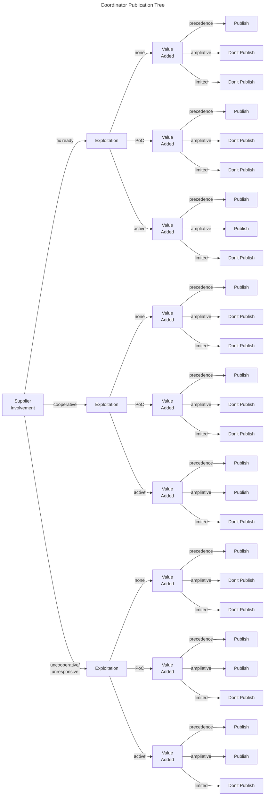

# Coordinator Publication Decision

A coordinator often has to decide when or whether to publish information about a vulnerability.
A supplier also makes a decision about publicity—releasing information about a remediation or mitigation could be viewed as a kind of publication decision.
While the context of publication is different for coordinators, a supplier may find some use in a publication decision if they need to decide whether to publish before a mitigation or remediation is available.
However, that is not the intended use case; this section describes how a coordinator might decide to publish information about a vulnerability.

!!! tip "The Publication Decision is Time Sensitive"

    The publication decision is always a decision at a point in time.
    As discussed in [Guidance on Communicating Results](bootstrap/use.md), a SSVC decision may change over time as the inputs to that decision change.
    A decision to publish cannot be revoked, since the publication is likely to be archived or at least remembered.
    However, a decision to not publish is a decision not to publish at the time the decision was made.
    It is not a decision never to publish in the future.
    
    One benefit of encoding the decision process in SSVC is the analysts can all agree on what new information would change the decision and prioritize maintaining awarenss of just those decision points. 

This section is based on CERT/CC policy choices.
Two points where this clearly influences the publication decision are embargo periods and scope.
As a matter of policy, CERT/CC will support an embargo from the public of information about a vulnerability through its choice not to publish that information while a number of conditions hold:
   
  - A negotiated embargo timer has not expired. The CERT/CC default embargo period is [45 days](https://vuls.cert.org/confluence/display/Wiki/Vulnerability+Disclosure+Policy).
  - Other exceptions have not been met, including active exploitation of the vulnerability in the wild or other public discussion of the vulnerability details.

Regardless, the decision described in this section assumes the embargo period is over, one way or another.
The second point is related to the [Coordination Triage Decisions](coordination_decisions.md) and the status of the vulnerability.
CERT/CC only expects to publish about vulnerabilities with a [*coordinate*](coordination_decisions.md) status.
While an issue that is tracked or declined may be reevaluated at a later date and status changed to [*coordinate*](coordination_decisions.md), unless that happens we would not publish about the vulnerability.
Other organizations, such as [NVD](https://nvd.nist.gov/), would have different publication criteria and may want to include decision points or the decision itself from the [Coordination Triage Decisions](coordination_decisions.md) in their publication decision.

In addition to the two decision points defined in this section, the publication decision uses the [*Exploitation*](../reference/decision_points/exploitation.md) decision point.

- [Public Value Added](../reference/decision_points/public_value_added.md)
- [Supplier Involvement](../reference/decision_points/supplier_involvement.md)

## Coordinator Publication Decision Tree

Suggested decision values for this decision are available in
[CSV](https://github.com/CERTCC/SSVC/blob/main/data/csvs/coord-publish-options.csv)
and
[PDF](../pdf/ssvc_2_coord-publish.pdf) formats.

<!-- 
<embed src="../../pdf/ssvc_2_coord-publish.pdf" alt="Suggested tree for a coordinator's publication decision" type="application/pdf"
style="width: 100%;"
height = "600" />
-->

### Table of Values

<!-- relative to /data/csvs/ -->
{{ read_csv('coord-publish-options.csv') }}

