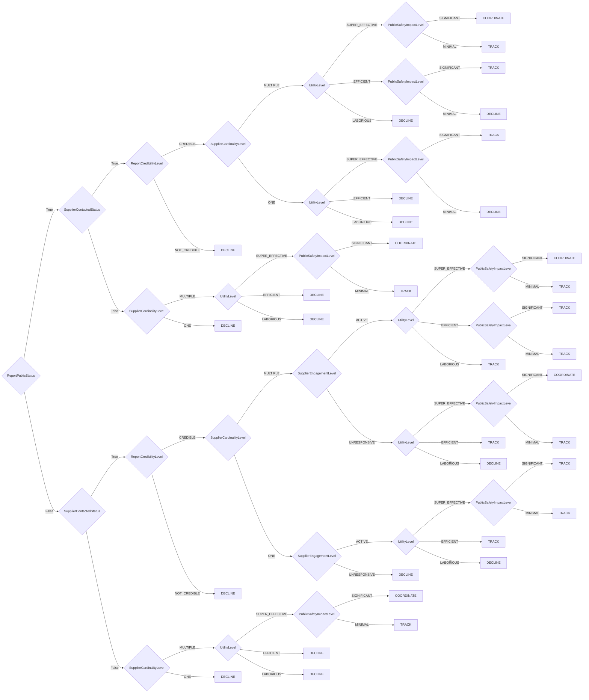

# Stakeholder-Specific Vulnerability Categorization

SSVC stands for A Stakeholder-Specific Vulnerability Categorization.
It is a methodology for prioritizing vulnerabilities based on the needs of the stakeholders involved in the vulnerability management process.
SSVC is designed to be used by any stakeholder in the vulnerability management process, including finders, vendors, coordinators, deployers, and others.

## Where to go from here

We have organized the SSVC documentation into four main sections:

- :fontawesome-regular-eye:{ .lg .middle } **SSVC Overview**

    ---

    A beginner's guide to SSVC.
    This section is for people who have never heard of SSVC.

    [:octicons-arrow-right-24: An Overview of SSVC](ssvc_overview.md)

- :material-clipboard-check:{ .lg .middle } **SSVC How To**

    ---

    Start using SSVC in your organization today with step-by-step instructions.
    This section is intended for people who are already familiar with SSVC and want to start using it.

    [:octicons-arrow-right-24: SSVC How To](howto/index.md)

- :fontawesome-solid-book:{ .lg .middle } **More about SSVC**

    ---

    Dig deeper to understand the SSVC methodology and how it works.
    This section is intended for people who are already familiar with SSVC and want to learn more.

    [:octicons-arrow-right-24: Understanding SSVC](topics/index.md)

- :material-book-open-page-variant:{ .lg .middle } **SSVC Reference**

    ---

    Reference documentation for SSVC.
    This section is intended for people who are already familiar with SSVC and want to look up specific details.

    [:octicons-arrow-right-24: Reference](reference/index.md)



