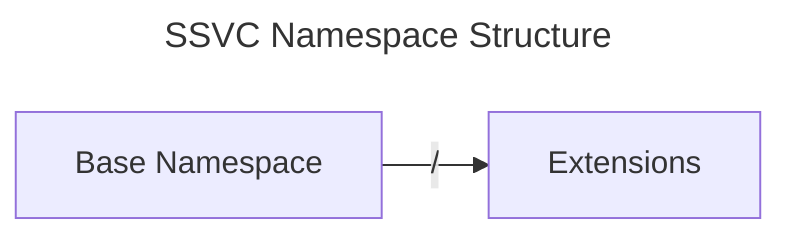
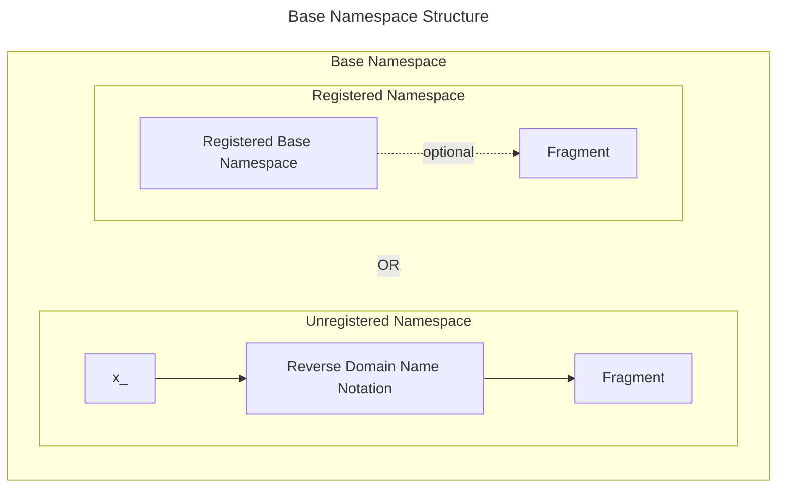
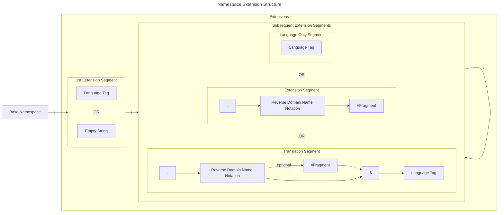

# SSVC Namespaces

We use namespaces in SSVC to organize the various components of the framework.
The bulk of our work is done in the `ssvc` namespace, which contains the core
decision points for SSVC.

!!! question "Why does SSVC need namespaces?"

    We want to provide a clear way to differentiate between decision points we
    developed as part of the SSVC project, and those that are derived from work
    done by other projects. This helps us maintain clarity in our codebase and
    to avoid confusion when integrating with other systems or libraries.

## Namespace Structure

Namespaces are structured as follows:



A namespace consists of a base namespace and optional extensions.

### Base Namespace

The base namespace can be either registered or unregistered.
The following diagram illustrates the structure of the base namespace:



!!! warning "Reserved Namespace Strings"
    
    The SSVC project has _reserved_ the following namespace strings:

    - `example` and `x_example`are _reserved_ for use in documentation or as 
    examples where a registered or unregistered namespace is needed, respectively.
    No production use of the `example` or `x_example` namespace is intended.

    - `test` and `x_test` are _reserved_ for use in testing of current 
    or new SSVC related code.
    No production use of the `test` namespace is intended.

    - `invalid` and `x_invalid` are _reserved_ and must not be used as
    registered or unregistered namespaces, respectively. Attempting to create an
    object using either of these strings will result in an error in the Python
    implementation of SSVC.


!!! info inline end "Current Registered Namespaces"

    The SSVC project currently has a set of registered namespaces that are
    intended to be used as part of the framework. These namespaces are defined
    in the `ssvc.namespaces` module and can be accessed via the `NameSpace` enum.
    Current registered namespaces are:

    ```python exec="true" idprefix=""
    from ssvc.namespaces import NameSpace
    
    for ns in NameSpace:
        print(f"- {ns.value}")
    ```


#### Registered Namespace

Registered namespaces are those that are explicitly defined in the SSVC project.
A list of the current registered namespaces can be found in the sidebar.

Registered namespaces are intended to be used as follows:

- Objects in the `ssvc` namespace are managed by the SSVC
  project team. We have complete control over these ones.
- Objects in other explicitly registered namespaces are provided for convenience,
  but the SSVC team is not responsible for modifying the content or semantics of
  those decision points.
- The registered namespaces `example` and `test` can be used in documentation or
  as examples, where registered namespaces are necessary.

!!! note "Registered Non-`ssvc` Namespaces"

    We use namespaces other than `ssvc` to indicate decision points that are based 
    externally defined standards, specifications, or relevant projects.
    We expect for decision points in these namespaces to be technically compatible 
    with SSVC, but we do not claim any ownership or responsibility for the
    underlying specifications or their semantic content. 
    Objects in these namespaces are provided for the convenience
    of SSVC users to allow them to use these decision points in their SSVC
    decision models without needing to implement them from scratch.
    
    While we are happy to resolve technical issues with these decision points as
    technically implemented in the SSVC project, all suggestions for changes to the 
    underlying specifications or semantic content should be directed to the 
    maintainers of the respective projects or standards. 

!!! example "The `cvss` namespace"

    We wanted to allow SSVC users to include Common Vulnerability Scoring System
    (CVSS) vector elements as [decision points](../decision_points/cvss/index.md)
    in their SSVC decision models. 
    So we created the `cvss` namespace to contain 
    [decision points](../decision_points/cvss/index.md) that are
    based on various versions of the CVSS. These 
    [decision points](../decision_points/cvss/index.md) are provided
    as part of the SSVC project for convenience, but we do not maintain the 
    underlying CVSS specifications, their semantic content or their implementations.
    Suggestions for changes to the CVSS specifications should be directed to the
    [FIRST CVSS Special Interest Group](https://www.first.org/cvss/) (SIG).

!!! note "Use of (Optional) Fragments in Registered Namespaces"

    The optional fragment string following the `#` character in a registered 
    namespace is used to indicate a grouping or subset of decision points within
    the same namespace.
    This allows us to organize decision points that are related or share a common
    context within the same namespace.
    
!!! example "Fragment Usage in Registered Namespaces"
    
    We use the `nist` namespace for decision points based on NIST standards, and
    fragments to differentiate between decision points based on different NIST publications,
    e.g., `nist#800-30` for decision points based on NIST Special Publication 800-30.

    We may in the future add namespaces when needed to reflect different standards 
    bodies like `iso-iec`, `ietf`, `oasis`, etc. We would expect to use fragments
    in a similar way to differentiate between different standards or publications
    from the same standards body.

!!! question "How do I request a new registered namespace?"

    If you have a suggestion for a new registered namespace, please open an
    issue in the [SSVC GitHub repository](https://github.com/CERTCC/SSVC/issues)
    and provide a brief description of the namespace and its intended use.

#### Unregistered Namespace

Unregistered namespaces are those that are not explicitly defined in the SSVC project.
Because unregistered namespaces are not managed by the SSVC project team,
there is no strict guarantee of uniqueness across different users or organizations.
However, because we require unregistered namespaces to use reverse domain name notation,
we expect that this will rarely lead to conflicts in practice.

!!! info "Unregistered Namespace Requirements"

    Unregistered namespaces must follow the following structure:

    - Unregistered namespaces must use the `x_` prefix.
    - Following the `x_` prefix, unregistered namespaces must use reverse domain name
      notation of a domain under their control to ensure uniqueness.
    - After the reverse domain name, a fragment separated by `#` must follow.
    - The construct of reverse domain name followed by `#` and a fragment is called `x-name`.
    - For any domain using other characters, DNS Punycode must be used
    - Aside from the required `x_` prefix and the fragment separator `#`, unregistered
      namespaces must contain only alphanumeric characters, dots (`.`), and dashes (`-`).

!!! note "Fragment Usage is Required in Unregistered Namespaces"

    In unregistered namespaces, the fragment is _required_. This is different from
    registered namespaces, where the fragment is _optional_.

    
!!! warning "Namespace Conflicts"

    Conflicts are possible in the `x_` prefix space - especially as the control over a
    domain may be transferred. 
    Also in tests, Organizations A and B could both choose to use 
    `x_example.test#test`, and there are no guarantees of global uniqueness for the
    decision points in the `x_example.test#test` namespace.


!!! info "Documentation and Test Namespaces"

    Any namespace starting with `x_example` can be used in documentation or as examples,
    where a unregistered namespace is needed.
    The namespace `x_example.test#test` is recommended for use in testing of current or
    new SSVC related code.
    The namespace `x_example.test#documentation` is recommended for use in documentation
    or as examples.

!!! tip "Test Namespace"

    The `x_example.test#test` namespace is commonly used for testing purposes and is not
    intended for production use. It is used to test the SSVC framework and its components,
    and may contain decision points that are not fully implemented or tested.

### Namespace Extensions

Namespace extensions allow users to extend the SSVC namespaces to clarify existing decision points
from a base namespace.
Extensions are optional and may be used to refine or clarify existing decision points.
Extensions allow SSVC users to create decision points that are specific to their
constituencies or to provide translations of existing decision points.


!!! info "Namespace Extension Semantic Requirements"

    Extensions must follow the following requirements:
    
    - Extensions must not alter the decision point key, version number, or value keys 
      for any decision point they are derived from.
    - Extensions must not alter the meaning of existing values, or add values to 
      existing decision points in the parent namespace.
    - Extensions may reduce the set of values for a decision point in the parent
      namespace, but must not add new values.

    See also the "Namespace Extension Structural Requirements" below.

!!! question "Why are the Namespace Extension Semantic Requirements important?"

    The way extensions are built enables tools to process the decision points even if
    they do not know the defined extension. As long as the tool knows the base
    namespace, it can process the decision point.

!!! question "What if I want to create a new decision point?"

    If you want to create a new decision point, please use an unregistered namespace
    as described above instead of an extension.
    Extensions are not intended to be used to create new decision points.


#### Namespace Extension Structure

The first extension segment is reserved for an optional BCP-47 language tag, which may be left empty.

!!! info "Default language is `en-US`"

    If the first extension segment is left empty, the default language (`en-US`) is implied.

Subsequent extension segments must either

- be a valid BCP 47 language tag (marking an official translation from the previous extension segment entity),
- begin with a `.` followed by an `x-name` (reverse domain name notation string, the fragment separator `#` and a fragment), or
- be a `translation`.

Except for the delimiters, an extension segment must not contain any other characters than alphanumeric
characters (upper or lower case), dots (`.`), and dashes (`-`).
Only a single fragment identifier (`#`) is allowed per extension segment.
Fragment segments should be used to indicate a specific interpretation or context for the extension.
Note: Without a fragment segment, all decision points of an organization would fall into one bucket,
which is in most cases not intended. Therefore, the use of a fragment segment is required from the start.

A `translation` starts with a `.` is followed by a reverse domain name or an `x-name`.
Subsequently, a `$` followed by a valid BCP 47 language tag ends the string.
Note: If the `translation` uses just the reverse domain name followed by the language tag,
e.g. `.example.test$de-DE`, this implies an unofficial translation done by the entity in possession of that
domain name.
A `translation` using an `x-name` indicates that the extension bases of a collection that had a different language
and no formal translation was used to develop that collection.
The following diagram illustrates the structure of namespace extensions:



!!! info "Namespace Extension Structural Requirements"

    Extensions must follow the following structure:
  
    - Extension segments are separated by slashes (`/`).
    - Multiple extension segments are allowed.
    - If any extension segments are present, the first segment must be a valid BCP-47 language tag or an empty string.
    - When the first segment is left as an empty string, the default language (`en-US`) is implied.
    - Subsequent extension segments must begin with a reverse domain name notation string or be a valid, non-empty BCP-47 language tag.
    - A fragment identifier (`#`) may be included in extension segments.
    - Extension segments may contain alphanumeric characters (upper or lower case), dots (`.`), and dashes (`-`), and zero or one hash (`#`) and zero or one dollar sign (`$`).
    - Extensions must not alter the decision point key, version number, or value keys for any decision point they are derived from.
    - Extensions may reduce the set of values for a decision point in the parent namespace, but must not add new values.

    The structure of the namespace string is intended to show inheritance for
    variations on SSVC objects. 


!!! tip "Extension Order Matters"

    SSVC namespace extension order carries semantic meaning. 
    
    | Example | Meaning |
    |---------|---------|
    | `ssvc/de-DE/.example.organization#ref-arch-1` | Denotes (a) an official German (Germany) translation of the SSVC decision points is available, and (b) that this translation has been extended with an extension by `organization.example` to fit their specific needs for `ref-arch-1`.|
    | `ssvc//.example.organization#ref-arch-1/de-DE` | Denotes that (a) the `.example.organization#ref-arch-1` extension is available in the default language (`en-US`), and (b) that this extension has been translated into German (Germany). |

!!! example "Use of fragment identifiers and language tags"

    Imagine an Information Sharing and Analysis Organization (ISAO) `isao.example`
    wants to create an extension to refine an existing decision point in the `ssvc` namespace
    with additional context for a part of their constituency. They could create an extension
    namespace like `ssvc//.example.isao#constituency` to indicate that this extension
    is specifically tailored for a particular constituency within the ISAO.
    Note the empty first segment, which implies the default language (`en-US`).

    If they further chose to create a Polish language version of their extension,
    they would add a language segment _following_ their extension namespace,
    e.g., `ssvc//.example.isao#constituency/pl-PL`. Note that this is different 
    from a hypothetical `ssvc/pl-PL/.example.isao#constituency` extension, which would imply
    that the `ssvc` namespace has been officially translated to Polish (Poland) and then
    extended (in Polish) with the `.example.isao#constituency` extension.

    It is also different from `ssvc//.example.isao$pl-PL/example.isao#constituency` which
    denotes that the ISAO did a translation of the `ssvc` namespace to Polish and based
    the collection for their constituency on that translation.

!!! example "Refinement of Concepts for a Specific Constituency"

    A sector-specific information sharing and analysis organization (ISAO)
    might create an extension for their specific constituency. 
    For example, say that a hypothetical registered namespace `foo`
    has a decision point for `Regulated System=(Y,N)`.
    A medical-focused ISAO might create an extension 
    `foo//.example.med-isao#specific-regulations` where they refine the values to refer 
    to specific regulations. If multiple regulatory regimes exist, they might even have
    `foo//.example.med-isao#regulation-1` and `foo//.example.med-isao#regulation-2`
    to cover assessment of the appropriate regulations.

### Usage Suggestions

Although we reserved the first segment of the extension for language tags,
there are scenarios where it may be appropriate to use a language tag in a later
segment of the extension.

!!! tip "Use BCP-47 Language Tags"

    Regardless where they appear in the extension strings, BCP-47 language tags
    must be used for any language-based extension.
    Note, however that we do not yet strictly enforce this recommendation in the 
    SSVC codebase outside of the first extension segment.
    Nevertheless, validators should check that the used strings are valid BCP-47
    language tags and exist.

!!! example "Translation of a custom extension"

    If you have a custom extension that is not a translation of an existing
    decision point, you might use a language tag in a later segment to indicate
    a translation of the extension. 
    For example, `ssvc//.example.documentation#extension/pl-PL` would indicate that the
    an extension in the default `en-US` language has been translated to Polish (Poland).

!!! tip "Use Reverse Domain Name Notation for Extensions"

    To avoid conflicts with other users' extensions, we require the use of reverse
    domain name notation for your extensions. This helps to ensure that your
    extensions are unique and easily identifiable.
    For example, if your organization is `documentation.example`, you might use an extension
    like `ssvc//.example.documentation#extension`.

## Technical requirements

The following technical requirements are enforced for SSVC namespaces,
based on the implementation in `src/ssvc/namespaces.py`
and the ABNF specification in
[data/abnf/ssvc_namespace_pattern.abnf](../../../data/abnf/ssvc_namespace_pattern.abnf):

- Namespaces must be between 3 and 1000 characters long.

(The ABNF is used to generate the regular expressions in
`src/ssvc/utils/patterns.py`, see the comment in the source code there.)

## The `ssvc.namespaces` module

The `ssvc.namespaces` module provides a way to access and use these namespaces.

::: ssvc.namespaces
