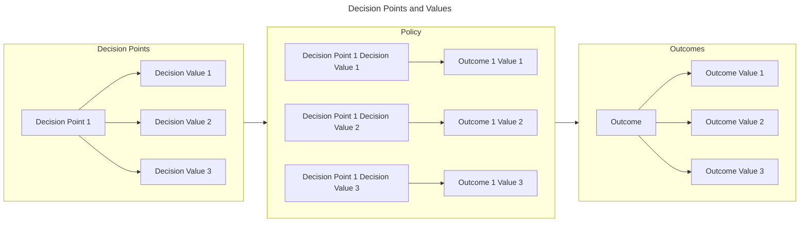

# Introduction

This documentation defines a testable Stakeholder-Specific Vulnerability Categorization (SSVC) for prioritizing actions during vulnerability management.
The stakeholders in vulnerability management are diverse.
This diversity must be accommodated in the main functionality, rather than squeezed into hard-to-use optional features.
Given this, we aim to avoid one-size-fits-all solutions as much as it is practical.

We will improve vulnerability management by framing decisions better.
The modeling framework determines what output types are possible, identifies the inputs, determines the aspects of vulnerability management that are in scope, defines the aspects of context that are incorporated, identifies how to handle changes over time, describes how the model handles context and different roles, and determines what those roles should be.
As such, the modeling framework is important but difficult to pin down.
We approach this problem as a satisficing process.
We do not seek optimal formalisms, but an adequate formalism.

{== DRAFT ==}

{== SSVC models individual vulnerability management decisions. ==} 
{==
- A set of _inputs_ variables that are relevant to the decision. These are the _decision points_. 
- Decision point are independent variables.
- In SSVC, _decision points_ are an ordered set of enumerated values
- Ordered because they are sortable in some dimension
- Enumerated because they are finite and discrete
- An _output_ variable that are relevant to the decision. These are the _outcome_.
- Outcome is also an ordered set of enumerated values
- Usually indicating a priority or urgency (defer, scheduled, out-of-cycle, ...)
- A _policy_ that maps each combination of the set of decision point values to the set of outcome values.
- a decision function that accepts a set of decision point values and returns an outcome value
==}

{== We usually represent a decision function as a decision tree.
The trees we show reflect both the policy and the decision function.
However we should be clear that this is for convenience and not a requirement.
The underlying decision function that maps every combination of decision point values to an outcome value is the same regardless of how we represent it.
==}

Our decision-making process is based on decision trees.
A decision tree represents important elements of a decision, possible decision values, and possible outcomes.
We suggest decision trees as an adequate formalism for practical, widespread advice about vulnerability prioritization.
We do not claim this approach is the only viable option.
We suggest that specific vulnerability management stakeholder communities use decision trees.
These suggestions are hypotheses for viable replacements for CVSS in those communities, but the hypotheses require empirical testing before they can be justifiably considered fit for use.
We propose a methodology for such testing.

This documentation describes version 2 of SSVC.
The main improvements from version 1 are the addition of the coordinator stakeholder perspective, improvements to terminology, integration of feedback on decision point definitions, and tools to support practical use.
These changes are described in more detail in [Version 2 Changelog](#version-2-changelog).

{== REVISE for webification ==}
{== The documentation is organized as follows.

- [Current State of Practice](#current-state-of-practice) summarizes the current state of vulnerability management.
- [Representing Information for Decisions About Vulnerabilities](#representing-information-for-decisions-about-vulnerabilities) describes our design goals for an improved prioritization method.
- [Vulnerability Management Decisions](#vulnerability-management-decisions) defines who the decision makers are and what options they are deciding among.
- [Likely Decision Points and Relevant Data](#likely-decision-points-and-relevant-data) proposes a definition of decision points that a stakeholder might use during vulnerability management.
- [Prioritization](#prioritization) combines these decision points into example decision trees that can be used to prioritize action on a work item.
- [Evaluation of the Draft Trees](#evaluation-of-the-draft-trees) describes an early test of this method against the design goals, as much to show an adequate usability test methodology as for the results.
- [Worked example](#worked-example) provides examples of applying the methodology to sample vulnerabilities and discusses the relationship between SSVC and other vulnerability management prioritization systems.
- [Future Work](#future-work) identifies ideas we haven't had time to incorporate yet.
- [Limitations](#limitations) identifies limitations in the design.
- [Conclusion](#conclusion) provides some final thoughts.
 ==}