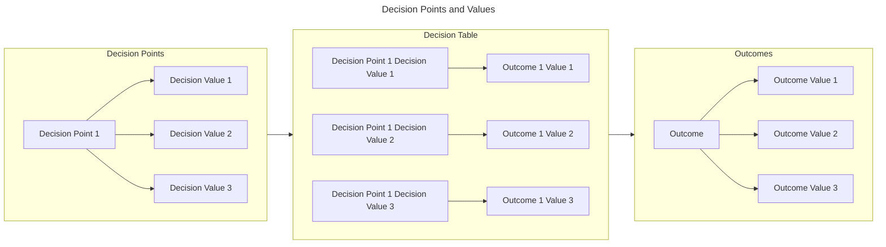

# Introduction

!!! tip inline end "Prerequisites"

    The [Understanding SSVC](index.md) section assumes that you have
    
    - Basic familiarity with SSVC
    - An interest in learning more about the details of SSVC

    If you are unfamiliar with SSVC, we suggest you start with the [Learning SSVC](../tutorials/index.md) section.
    [SSVC How-To](../howto/index.md) provides practical guidance for implementing SSVC in your organization.
    For technical reference, see [Reference](../reference/index.md).

This documentation defines a testable Stakeholder-Specific Vulnerability Categorization (SSVC) for prioritizing actions during vulnerability management.
The stakeholders in vulnerability management are diverse.
This diversity must be accommodated in the main functionality, rather than squeezed into hard-to-use optional features.
Given this, we aim to avoid one-size-fits-all solutions as much as it is practical.

We will improve vulnerability management by framing decisions better.
The modeling framework determines what output types are possible, identifies the inputs, determines the aspects of vulnerability management that are in scope, defines the aspects of context that are incorporated, identifies how to handle changes over time, describes how the model handles context and different roles, and determines what those roles should be.
As such, the modeling framework is important but difficult to pin down.
We approach this problem as a satisficing process.
We do not seek optimal formalisms, but an adequate formalism.

## Key Concepts in SSVC Decision Models

SSVC models individual vulnerability management decisions. It is built around the following concepts:

- **Decision Points** are the independent variables that are relevant to the decision.
  Each decision point represents a different aspect or dimension of the decision.
- **Decision Values** are the possible values for a decision point. The decision values (or *decision point values*)
  are an ordered set of enumerated values. They are ordered because they are sortable in some dimension, usually
  having to do with priority or urgency. They are enumerated because they are finite and discrete.
- **Outcomes** are the dependent variables that are relevant to the decision. Each outcome represents a different
  possible result of the decision.
- **Outcome Values** are the possible values for an Outcome. Outcomes are similarly defined as an ordered set of
  enumerated values, usually indicating a priority or urgency.
- A **Decision Table** is a mapping from each combination of decision point values to the set of outcome values.
- A **Decision Function** is a function that accepts a set of decision point values and returns an outcome value based
  on a decision table.

!!! question "Where do the trees come in?"

    Our initial concept for SSVC's decision modeling was based on decision trees.
    A decision tree represents important elements of a decision, possible decision values, and possible outcomes.
    We often represent a decision function as a decision tree because it is a convenient way to represent
    a **Decision Table** as a branching decision structure.    
    We do not claim this approach is the only viable option.

    In particular, we have received feedback that decision trees are not always the best way to represent
    the decision function, because stakeholders have different access to the information needed to make decisions.
    We are open to other representations of the decision function, and we are open to representing the decision
    function in multiple ways to accommodate different stakeholders.

    The underlying decision function that maps every combination of decision point values to an outcome value is the
    same regardless of how we represent it, or the order in which the decision points are considered.
    In other parts of the documentation, we use tables to represent the same information. Trees provide a
    convenient way to visualize the decision function, but they are not a requirement of the model.

## Topics Overview

The remainder of this section is organized as follows:

- :material-state-machine: [**Current State of Practice**](state_of_practice.md)
- :material-information-box-outline: [**Representing Information for Decisions About Vulnerabilities**](representing_information.md)
- :material-arrow-decision: [**Vulnerability Management Decisions**](vulnerability_management_decisions.md)
- :material-toy-brick-outline: [**Putting the Pieces Together**](decision_points_as_bricks.md)
- :material-file-document-check-outline: [**Worked Example**](worked_example.md)
- :material-checkbox-marked-outline: [**Evaluation**](evaluation_of_draft_trees.md)
- :material-relation-one-to-many: [**Related Systems**](related_systems.md)
- :material-inbox-arrow-down: [**Information Sources**](information_sources.md)
- :material-wall: [**Limitations**](limitations.md)
- :material-chart-timeline-variant-shimmer: [**Future Work**](future_work.md)

