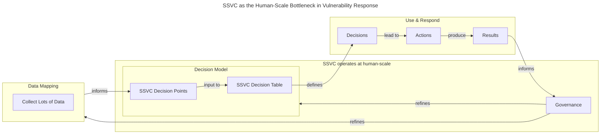

# SSVC: The Human-Scale Bottleneck in Automated Vulnerability Response

SSVC serves as the human-scale interface between automated vulnerability data
collection and operational response. The framework is *designed by humans* and
*understood by humans*: the design and governance of the decision logic is the
human-scale work, not the execution of individual decisions. Crucially, this
does *not* mean that a human must manually review every vulnerability
decision—the decision table, once defined, can be entirely automated.
In AI and autonomous systems terminology, this makes SSVC a
*human-**on**-the-loop* (HOTL) pattern: humans are not required to approve
every decision, but they are responsible for designing, governing, and
monitoring the framework that makes those decisions.

Vulnerability response is increasingly driven by automation.
On the input side, [Data Mapping](../howto/bootstrap/collect.md) funnels large-scale
data
collection into the small set of SSVC decision points.
On the output side, [Use & Respond](../howto/bootstrap/use.md) fans the model's outputs
out into operational decisions at scale.
SSVC sits in the middle as the human-scale interface where organizational policy
is defined and refined into decision support tools that can be automated.
This approach ensures that while the process is efficient and automated, the
core decision-making remains transparent, accountable, and aligned with
organizational risk appetite, providing a necessary bridge between technical
data and business policy.

In the diagram above, the `Decision Model` subgraph (containing SSVC Decision
Points and the Decision Table) represents the SSVC scope. Data Mapping and
Use & Respond are adjacent processes that interface with SSVC on either side
but are outside its core scope.

## Condensing Complexity into Human-Scale Decisions

The initial stages of vulnerability
response—[data collection and mapping](../howto/bootstrap/collect.md)—often involve large
amounts of information, various data sharing formats (e.g., [CSAF](https://www.csaf.io/),
[CVE JSON](https://cveproject.github.io/cve-schema/schema/docs/)), and
diverse analytical tools, increasingly including AI features like large
language models (LLMs). SSVC's
core function is to condense this extensive, complex dataset into a small,
manageable set of [decision points](/reference/decision_points/index.md).

These decision points possess several key characteristics that make them
suitable for human oversight and policy definition:

- **Densely Defined and Ordinal:** Each decision point uses values that are
  ordered (ordinal variables), moving from least likely to most likely to imply
  action (e.g., Low, Medium, High). This ordering provides a clear, qualitative
  progression without implying equal spacing between values.
- **Orthogonal and Independent:** The chosen decision points capture unique
  dimensions of the problem. By minimizing conceptual overlap, the model ensures
  that each dimension contributes independently to the final outcome, keeping
  the overall decision table compact and easier to reason about. The goal is to
  have completely independent decision points to reduce ambiguity.
- **Chunky Values:** To prevent the decision space from becoming unmanageable,
  decision points are limited to a small number of values, typically two to
  five. This restriction keeps the size of the final decision table small, as
  the total table size is the product of the value counts for each decision
  point.

## The Decision Table: Policy as Code

By defining a set of orthogonal, ordered decision points, SSVC induces a
*partial order* on the entire input space (the Cartesian product of all
decision point values). The resulting ordered set of input combinations is then
mapped, via a [decision table](/topics/decision_trees.md), onto a predefined
[outcome set](/reference/decision_points/outcomes) of ordered
outcomes.

The decision table serves as the codified organizational policy. The outcomes
are also ordered and typically represent service-level expectations (SLEs),
priorities (e.g., Low, Medium, Critical), or prescribed actions (e.g., Defer,
Scheduled, Out-of-Cycle, Immediate). This mapping of inputs to output values
defines the policy.

Key criteria for the decision table design include:

| Criterion             | Rationale                                                                                                                                                                                                                 |
|:----------------------|:--------------------------------------------------------------------------------------------------------------------------------------------------------------------------------------------------------------------------|
| **Small Size**        | Avoids complexity; keeps the number of questions required for analysis minimal (ideally 2-7 inputs, not dozens). Collecting and discriminating between dozens of values comes at an unnecessary cost.                     |
| **Orthogonal Inputs** | Ensures inputs are independent, reducing ambiguity and overlap.                                                                                                                                                           |
| **Chunky Values**     | Limiting values per input (2-5) prevents exponential growth of the table size ($3 \times 3 \times 3 = 27$ rows; $4 \times 3 \times 3 \times 3 = 108$ rows).                                                               |
| **Understandability** | Decision points must be understandable to non-technical risk owners, focusing on business impact rather than technical specifics (e.g., "Criticality of Affected System" instead of "Buffer Overflow vs. SQL Injection"). |

## The Role of the Human in a Machine-Driven World

With the decision table in place, automation can handle the volume—but humans
remain accountable for the quality and appropriateness of the policy that
drives it.

### Accountability and Risk Alignment

The decision table provides an explicit, unambiguous link between technical
vulnerability characteristics and organizational risk appetite. This structure
facilitates crucial conversations between technical staff—who are responsible
for developing or deploying mitigations and fixes—and risk owners
(CISO, IT management, senior management),
transferring responsibility from technical staff making proxy judgments to risk
owners defining explicit policy.

- **Before SSVC:** Technical staff make proxy judgments based on complex
  scores (e.g., CVSS 7.6 vs. 5.9), which risk owners often don't fully
  comprehend.
- **With SSVC:** Decisions are explained using comprehensible terms: "We are
  responding immediately because this has **High Technical Impact** and affects
  a **Critical Central Server**. This aligns with our established policy." The
  risk owner can also explain this policy up to their management.

### Governance and Policy Refinement

SSVC is designed for straightforward modification, enabling
policy owners to easily adapt their response posture when needed. Changes
can be managed through predictable steps. This process ensures that when a risk owner
desires a change, the modification to the decision table can be
clearly executed and understood.

The SSVC governance process—described in detail in
the [Prepare](../howto/bootstrap/prepare.md#establish-governance) step of the Getting
Started guide—is what makes this refinement practical. Because the decision
table is small and explicit, conversations about policy changes stay grounded:

> *"Why did we respond that way?"*  
> "Because conditions A, B, and C were all met."  
> *"I think we should have responded differently in that case."*  
> "Should we add a new condition D to every decision, or just re-label the
outcome for the row where (A, B, C) applies?"

This kind of structured conversation is exactly what SSVC is designed to enable.
A lightweight governance process periodically reviews each element of the model:

- Are the *outcomes* still relevant to the organization?
- Are the *decision points* capturing the right dimensions of the problem?
- Does the *decision table* still reflect how the organization wants to make
  decisions?
  - Have there been cases where the table led to a decision that was later
      regretted?
  - Are there new constraints or requirements not yet captured?
- Is the [data mapping](../howto/bootstrap/prepare.md) still appropriate—are the
  right data sources being used to assign values to decision points?

Depending on the review, adjustments can be made to any element of the
model—outcomes, decision points, the decision table, or data mapping. The
impact of those adjustments is predictable:

| Modification Type            | Impact on Table Size and Complexity                                                                                                                                                   |
|:-----------------------------|:--------------------------------------------------------------------------------------------------------------------------------------------------------------------------------------|
| **Adjusting Outcome Labels** | Simple fix; maintain existing inputs and values. Requires technical check to ensure partial order causality is maintained (e.g., low-risk inputs cannot have high-priority outcomes). |
| **Adding/Reducing Values**   | Small, measurable change. Adding a value increases the table size additively (e.g., $3 \times 3 \times 3 = 27$ to $4 \times 3 \times 3 = 36$).                                        |
| **Adding a Decision Point**  | Multiplicative increase in table size (e.g., $3 \times 3 \times 3 = 27$ to $3 \times 3 \times 3 \times 3 = 81$). Requires a more involved policy review.                              |

Crucially, governance should involve the right stakeholders. Risk owners must be
involved in reviewing and adjusting the decision table itself, while
vulnerability management and IT security teams are best positioned to review the
data mapping and decision point definitions. Observing the real-world results of
SSVC-driven decisions—as they flow back through operations—provides the
empirical basis for identifying where the model needs refinement.

## SSVC is Not a Process Bottleneck

Crucially, SSVC being a "human-scale bottleneck" does **not** mean it forces a
human to manually review every decision. The decision table, once defined, is
entirely automatable.

Automation can exist throughout the entire response workflow:

- **Input Automation:** AI (e.g., an LLM) can perform the "reading
  comprehension test"
  of analyzing raw vulnerability data and mechanically selecting the correct
  values for the SSVC decision points. The [data mapping](../howto/bootstrap/collect.md)
  established during [Prepare](../howto/bootstrap/prepare.md) defines how to
  connect data sources to decision point values.
- **Output Automation:** The prioritized outcome from the SSVC table (e.g., "Immediate") can feed directly into automated patching, ticketing, or software
  fix development systems. See [Use & Respond](../howto/bootstrap/use.md) for how to
  operationalize SSVC outcomes at scale.

SSVC acts as a fixed, unambiguous interface. The "human scale" element is in the
*design and governance* of this interface, ensuring human accountability and
understanding of the decision-making logic. The table's fixed structure means
there is no ambiguity—you know what the
output will be based on the defined inputs and policy. It is the locus where
technical reality meets organizational policy. SSVC embodies the
*human-on-the-loop* pattern: the human is responsible for the decision
framework—not every individual decision. This keeps humans accountable for
the policy while freeing them from the operational volume that automation
handles best.
