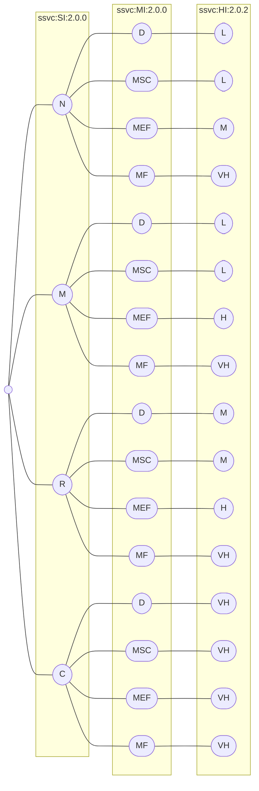
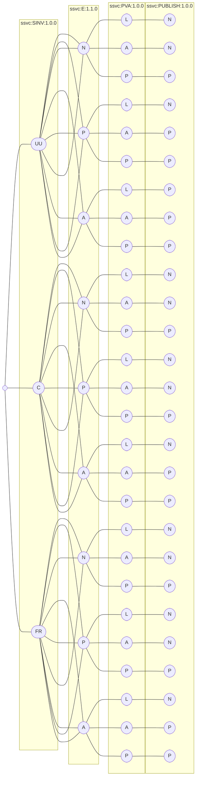

# Title

```mermaid
graph LR
n1(( ))
subgraph s1["ssvc:SI:2.0.0"]
N([N])
M([M])
R([R])
C([C])
end
subgraph s2["ssvc:MI:2.0.0"]
ND([D])
MD([D])
RD([D])
CD([D])
NMSC([MSC])
MMSC([MSC])
RMSC([MSC])
CMSC([MSC])
NMEF([MEF])
MMEF([MEF])
RMEF([MEF])
CMEF([MEF])
NMF([MF])
MMF([MF])
RMF([MF])
CMF([MF])
end
subgraph s3["ssvc:HI:2.0.2"]
NDs3([L])
MDs3([L])
RDs3([M])
CDs3([VH])
NMSCs3([L])
MMSCs3([L])
RMSCs3([M])
CMSCs3([VH])
NMEFs3([M])
MMEFs3([H])
RMEFs3([H])
CMEFs3([VH])
NMFs3([VH])
MMFs3([VH])
RMFs3([VH])
CMFs3([VH])

end
n1 --- N
n1 --- M
n1 --- R
n1 --- C
N --- ND
N --- NMSC
N --- NMEF
N --- NMF
M --- MD
M --- MMSC
M --- MMEF
M --- MMF
R --- RD
R --- RMSC
R --- RMEF
R --- RMF
C --- CD
C --- CMSC
C --- CMEF
C --- CMF
ND --- NDs3
MD --- MDs3
RD --- RDs3
CD --- CDs3
NMSC --- NMSCs3
MMSC --- MMSCs3
RMSC --- RMSCs3
CMSC --- CMSCs3
NMEF --- NMEFs3
MMEF --- MMEFs3
RMEF --- RMEFs3
CMEF --- CMEFs3
NMF --- NMFs3
MMF --- MMFs3
RMF --- RMFs3
CMF --- CMFs3
```

```mermaid
graph LR
n1(( ))
subgraph s1["ssvc:SINV:1.0.0"]
FR([FR])
C([C])
UU([UU])
end
subgraph s2["ssvc:E:1.1.0"]
FRN([N])
CN([N])
FRP([P])
UUN([N])
CP([P])
FRA([A])
UUP([P])
CA([A])
UUA([A])
end
subgraph s3["ssvc:PVA:1.0.0"]
FRNL([L])
CNL([L])
FRPL([L])
FRNA([A])
UUNL([L])
CPL([L])
FRAL([L])
CNA([A])
FRPA([A])
FRNP([P])
UUPL([L])
CAL([L])
UUNA([A])
CPA([A])
FRAA([A])
CNP([P])
FRPP([P])
UUAL([L])
UUPA([A])
CAA([A])
UUNP([P])
CPP([P])
FRAP([P])
UUAA([A])
UUPP([P])
CAP([P])
UUAP([P])
end
subgraph s4["ssvc:PUBLISH:1.0.0"]
FRs4Ns4Ls4Ns4([N])
Cs4Ns4Ls4Ns4([N])
FRs4Ps4Ls4Ns4([N])
FRs4Ns4As4Ns4([N])
UUs4Ns4Ls4Ns4([N])
Cs4Ps4Ls4Ns4([N])
FRs4As4Ls4Ns4([N])
Cs4Ns4As4Ns4([N])
FRs4Ps4As4Ns4([N])
FRs4Ns4Ps4Ps4([P])
UUs4Ps4Ls4Ns4([N])
Cs4As4Ls4Ns4([N])
UUs4Ns4As4Ns4([N])
Cs4Ps4As4Ns4([N])
FRs4As4As4Ps4([P])
Cs4Ns4Ps4Ps4([P])
FRs4Ps4Ps4Ps4([P])
UUs4As4Ls4Ps4([P])
UUs4Ps4As4Ps4([P])
Cs4As4As4Ps4([P])
UUs4Ns4Ps4Ps4([P])
Cs4Ps4Ps4Ps4([P])
FRs4As4Ps4Ps4([P])
UUs4As4As4Ps4([P])
UUs4Ps4Ps4Ps4([P])
Cs4As4Ps4Ps4([P])
UUs4As4Ps4Ps4([P])
end
n1 --- UU
n1 --- C
n1 --- FR
FR --- FRN
FRN --- FRNL
FRNL --- FRs4Ns4Ls4Ns4
C --- CN
CN --- CNL
CNL --- Cs4Ns4Ls4Ns4
FR --- FRP
FRP --- FRPL
FRPL --- FRs4Ps4Ls4Ns4
FR --- FRN
FRN --- FRNA
FRNA --- FRs4Ns4As4Ns4
UU --- UUN
UUN --- UUNL
UUNL --- UUs4Ns4Ls4Ns4
C --- CP
CP --- CPL
CPL --- Cs4Ps4Ls4Ns4
FR --- FRA
FRA --- FRAL
FRAL --- FRs4As4Ls4Ns4
C --- CN
CN --- CNA
CNA --- Cs4Ns4As4Ns4
FR --- FRP
FRP --- FRPA
FRPA --- FRs4Ps4As4Ns4
FR --- FRN
FRN --- FRNP
FRNP --- FRs4Ns4Ps4Ps4
UU --- UUP
UUP --- UUPL
UUPL --- UUs4Ps4Ls4Ns4
C --- CA
CA --- CAL
CAL --- Cs4As4Ls4Ns4
UU --- UUN
UUN --- UUNA
UUNA --- UUs4Ns4As4Ns4
C --- CP
CP --- CPA
CPA --- Cs4Ps4As4Ns4
FR --- FRA
FRA --- FRAA
FRAA --- FRs4As4As4Ps4
C --- CN
CN --- CNP
CNP --- Cs4Ns4Ps4Ps4
FR --- FRP
FRP --- FRPP
FRPP --- FRs4Ps4Ps4Ps4
UU --- UUA
UUA --- UUAL
UUAL --- UUs4As4Ls4Ps4
UU --- UUP
UUP --- UUPA
UUPA --- UUs4Ps4As4Ps4
C --- CA
CA --- CAA
CAA --- Cs4As4As4Ps4
UU --- UUN
UUN --- UUNP
UUNP --- UUs4Ns4Ps4Ps4
C --- CP
CP --- CPP
CPP --- Cs4Ps4Ps4Ps4
FR --- FRA
FRA --- FRAP
FRAP --- FRs4As4Ps4Ps4
UU --- UUA
UUA --- UUAA
UUAA --- UUs4As4As4Ps4
UU --- UUP
UUP --- UUPP
UUPP --- UUs4Ps4Ps4Ps4
C --- CA
CA --- CAP
CAP --- Cs4As4Ps4Ps4
UU --- UUA
UUA --- UUAP
UUAP --- UUs4As4Ps4Ps4
```