# Title

```mermaid
graph LR
n1(( ))
subgraph s1["cvss:AV:3.0.1"]
P_L0([P])
L_L0([L])
A_L0([A])
N_L0([N])
end
subgraph s2["cvss:PR:1.0.1"]
P_H_L1([H])
L_H_L1([H])
P_L_L1([L])
A_H_L1([H])
L_L_L1([L])
P_N_L1([N])
N_H_L1([H])
A_L_L1([L])
L_N_L1([N])
N_L_L1([L])
A_N_L1([N])
N_N_L1([N])
end
subgraph s3["cvss:UI:2.0.0"]
P_H_A_L2([A])
L_H_A_L2([A])
P_L_A_L2([A])
P_H_P_L2([P])
A_H_A_L2([A])
L_L_A_L2([A])
P_N_A_L2([A])
L_H_P_L2([P])
P_L_P_L2([P])
P_H_N_L2([N])
N_H_A_L2([A])
A_L_A_L2([A])
L_N_A_L2([A])
A_H_P_L2([P])
L_L_P_L2([P])
P_N_P_L2([P])
L_H_N_L2([N])
P_L_N_L2([N])
N_L_A_L2([A])
A_N_A_L2([A])
N_H_P_L2([P])
A_L_P_L2([P])
L_N_P_L2([P])
A_H_N_L2([N])
L_L_N_L2([N])
P_N_N_L2([N])
N_N_A_L2([A])
N_L_P_L2([P])
A_N_P_L2([P])
N_H_N_L2([N])
A_L_N_L2([N])
L_N_N_L2([N])
N_N_P_L2([P])
N_L_N_L2([N])
A_N_N_L2([N])
N_N_N_L2([N])
end
subgraph s4["cvss:EQ1:1.0.0"]
P_H_A_L_L3([L])
L_H_A_L_L3([L])
P_L_A_L_L3([L])
P_H_P_L_L3([L])
A_H_A_L_L3([L])
L_L_A_L_L3([L])
P_N_A_L_L3([L])
L_H_P_L_L3([L])
P_L_P_L_L3([L])
P_H_N_L_L3([L])
N_H_A_M_L3([M])
A_L_A_L_L3([L])
L_N_A_M_L3([M])
A_H_P_L_L3([L])
L_L_P_L_L3([L])
P_N_P_L_L3([L])
L_H_N_M_L3([M])
P_L_N_L_L3([L])
N_L_A_M_L3([M])
A_N_A_M_L3([M])
N_H_P_M_L3([M])
A_L_P_L_L3([L])
L_N_P_M_L3([M])
A_H_N_M_L3([M])
L_L_N_M_L3([M])
P_N_N_L_L3([L])
N_N_A_M_L3([M])
N_L_P_M_L3([M])
A_N_P_M_L3([M])
N_H_N_M_L3([M])
A_L_N_M_L3([M])
L_N_N_M_L3([M])
N_N_P_M_L3([M])
N_L_N_M_L3([M])
A_N_N_M_L3([M])
N_N_N_H_L3([H])
end
n1 --- P_L0
n1 --- L_L0
n1 --- A_L0
n1 --- N_L0
P_L0 --- P_H_L1
P_H_L1 --- P_H_A_L2
P_H_A_L2 --- P_H_A_L_L3
L_L0 --- L_H_L1
L_H_L1 --- L_H_A_L2
L_H_A_L2 --- L_H_A_L_L3
P_L0 --- P_L_L1
P_L_L1 --- P_L_A_L2
P_L_A_L2 --- P_L_A_L_L3
P_H_L1 --- P_H_P_L2
P_H_P_L2 --- P_H_P_L_L3
A_L0 --- A_H_L1
A_H_L1 --- A_H_A_L2
A_H_A_L2 --- A_H_A_L_L3
L_L0 --- L_L_L1
L_L_L1 --- L_L_A_L2
L_L_A_L2 --- L_L_A_L_L3
P_L0 --- P_N_L1
P_N_L1 --- P_N_A_L2
P_N_A_L2 --- P_N_A_L_L3
L_H_L1 --- L_H_P_L2
L_H_P_L2 --- L_H_P_L_L3
P_L_L1 --- P_L_P_L2
P_L_P_L2 --- P_L_P_L_L3
P_H_L1 --- P_H_N_L2
P_H_N_L2 --- P_H_N_L_L3
N_L0 --- N_H_L1
N_H_L1 --- N_H_A_L2
N_H_A_L2 --- N_H_A_M_L3
A_L0 --- A_L_L1
A_L_L1 --- A_L_A_L2
A_L_A_L2 --- A_L_A_L_L3
L_L0 --- L_N_L1
L_N_L1 --- L_N_A_L2
L_N_A_L2 --- L_N_A_M_L3
A_H_L1 --- A_H_P_L2
A_H_P_L2 --- A_H_P_L_L3
L_L_L1 --- L_L_P_L2
L_L_P_L2 --- L_L_P_L_L3
P_N_L1 --- P_N_P_L2
P_N_P_L2 --- P_N_P_L_L3
L_H_L1 --- L_H_N_L2
L_H_N_L2 --- L_H_N_M_L3
P_L_L1 --- P_L_N_L2
P_L_N_L2 --- P_L_N_L_L3
N_L0 --- N_L_L1
N_L_L1 --- N_L_A_L2
N_L_A_L2 --- N_L_A_M_L3
A_L0 --- A_N_L1
A_N_L1 --- A_N_A_L2
A_N_A_L2 --- A_N_A_M_L3
N_H_L1 --- N_H_P_L2
N_H_P_L2 --- N_H_P_M_L3
A_L_L1 --- A_L_P_L2
A_L_P_L2 --- A_L_P_L_L3
L_N_L1 --- L_N_P_L2
L_N_P_L2 --- L_N_P_M_L3
A_H_L1 --- A_H_N_L2
A_H_N_L2 --- A_H_N_M_L3
L_L_L1 --- L_L_N_L2
L_L_N_L2 --- L_L_N_M_L3
P_N_L1 --- P_N_N_L2
P_N_N_L2 --- P_N_N_L_L3
N_L0 --- N_N_L1
N_N_L1 --- N_N_A_L2
N_N_A_L2 --- N_N_A_M_L3
N_L_L1 --- N_L_P_L2
N_L_P_L2 --- N_L_P_M_L3
A_N_L1 --- A_N_P_L2
A_N_P_L2 --- A_N_P_M_L3
N_H_L1 --- N_H_N_L2
N_H_N_L2 --- N_H_N_M_L3
A_L_L1 --- A_L_N_L2
A_L_N_L2 --- A_L_N_M_L3
L_N_L1 --- L_N_N_L2
L_N_N_L2 --- L_N_N_M_L3
N_N_L1 --- N_N_P_L2
N_N_P_L2 --- N_N_P_M_L3
N_L_L1 --- N_L_N_L2
N_L_N_L2 --- N_L_N_M_L3
A_N_L1 --- A_N_N_L2
A_N_N_L2 --- A_N_N_M_L3
N_N_L1 --- N_N_N_L2
N_N_N_L2 --- N_N_N_H_L3
```




```mermaid
graph LR
n1(( ))
subgraph s1["cvss:EQ1:1.0.0"]
L_L0([L])
M_L0([M])
H_L0([H])
end
subgraph s2["cvss:EQ2:1.0.0"]
L_L_L1([L])
M_L_L1([L])
L_H_L1([H])
H_L_L1([L])
M_H_L1([H])
H_H_L1([H])
end
subgraph s3["cvss:EQ3:1.0.0"]
L_L_L_L2([L])
M_L_L_L2([L])
L_H_L_L2([L])
L_L_M_L2([M])
H_L_L_L2([L])
M_H_L_L2([L])
M_L_M_L2([M])
L_H_M_L2([M])
L_L_H_L2([H])
H_H_L_L2([L])
H_L_M_L2([M])
M_H_M_L2([M])
M_L_H_L2([H])
L_H_H_L2([H])
H_H_M_L2([M])
H_L_H_L2([H])
M_H_H_L2([H])
H_H_H_L2([H])
end
subgraph s4["cvss:EQ4:1.0.0"]
L_L_L_L_L3([L])
M_L_L_L_L3([L])
L_H_L_L_L3([L])
L_L_M_L_L3([L])
L_L_L_M_L3([M])
H_L_L_L_L3([L])
M_H_L_L_L3([L])
M_L_M_L_L3([L])
L_H_M_L_L3([L])
L_L_H_L_L3([L])
M_L_L_M_L3([M])
L_H_L_M_L3([M])
L_L_M_M_L3([M])
L_L_L_H_L3([H])
H_H_L_L_L3([L])
H_L_M_L_L3([L])
M_H_M_L_L3([L])
M_L_H_L_L3([L])
L_H_H_L_L3([L])
H_L_L_M_L3([M])
M_H_L_M_L3([M])
M_L_M_M_L3([M])
L_H_M_M_L3([M])
L_L_H_M_L3([M])
M_L_L_H_L3([H])
L_H_L_H_L3([H])
L_L_M_H_L3([H])
H_H_M_L_L3([L])
H_L_H_L_L3([L])
M_H_H_L_L3([L])
H_H_L_M_L3([M])
H_L_M_M_L3([M])
M_H_M_M_L3([M])
M_L_H_M_L3([M])
L_H_H_M_L3([M])
H_L_L_H_L3([H])
M_H_L_H_L3([H])
M_L_M_H_L3([H])
L_H_M_H_L3([H])
L_L_H_H_L3([H])
H_H_H_L_L3([L])
H_H_M_M_L3([M])
H_L_H_M_L3([M])
M_H_H_M_L3([M])
H_H_L_H_L3([H])
H_L_M_H_L3([H])
M_H_M_H_L3([H])
M_L_H_H_L3([H])
L_H_H_H_L3([H])
H_H_H_M_L3([M])
H_H_M_H_L3([H])
H_L_H_H_L3([H])
M_H_H_H_L3([H])
H_H_H_H_L3([H])
end
subgraph s5["cvss:EQ5:1.0.0"]
L_L_L_L_L_L4([L])
M_L_L_L_L_L4([L])
L_H_L_L_L_L4([L])
L_L_M_L_L_L4([L])
L_L_L_M_L_L4([L])
L_L_L_L_M_L4([M])
H_L_L_L_L_L4([L])
M_H_L_L_L_L4([L])
M_L_M_L_L_L4([L])
L_H_M_L_L_L4([L])
L_L_H_L_L_L4([L])
M_L_L_M_L_L4([L])
L_H_L_M_L_L4([L])
L_L_M_M_L_L4([L])
L_L_L_H_L_L4([L])
M_L_L_L_M_L4([M])
L_H_L_L_M_L4([M])
L_L_M_L_M_L4([M])
L_L_L_M_M_L4([M])
L_L_L_L_H_L4([H])
H_H_L_L_L_L4([L])
H_L_M_L_L_L4([L])
M_H_M_L_L_L4([L])
M_L_H_L_L_L4([L])
L_H_H_L_L_L4([L])
H_L_L_M_L_L4([L])
M_H_L_M_L_L4([L])
M_L_M_M_L_L4([L])
L_H_M_M_L_L4([L])
L_L_H_M_L_L4([L])
M_L_L_H_L_L4([L])
L_H_L_H_L_L4([L])
L_L_M_H_L_L4([L])
H_L_L_L_M_L4([M])
M_H_L_L_M_L4([M])
M_L_M_L_M_L4([M])
L_H_M_L_M_L4([M])
L_L_H_L_M_L4([M])
M_L_L_M_M_L4([M])
L_H_L_M_M_L4([M])
L_L_M_M_M_L4([M])
L_L_L_H_M_L4([M])
M_L_L_L_H_L4([H])
L_H_L_L_H_L4([H])
L_L_M_L_H_L4([H])
L_L_L_M_H_L4([H])
H_H_M_L_L_L4([L])
H_L_H_L_L_L4([L])
M_H_H_L_L_L4([L])
H_H_L_M_L_L4([L])
H_L_M_M_L_L4([L])
M_H_M_M_L_L4([L])
M_L_H_M_L_L4([L])
L_H_H_M_L_L4([L])
H_L_L_H_L_L4([L])
M_H_L_H_L_L4([L])
M_L_M_H_L_L4([L])
L_H_M_H_L_L4([L])
L_L_H_H_L_L4([L])
H_H_L_L_M_L4([M])
H_L_M_L_M_L4([M])
M_H_M_L_M_L4([M])
M_L_H_L_M_L4([M])
L_H_H_L_M_L4([M])
H_L_L_M_M_L4([M])
M_H_L_M_M_L4([M])
M_L_M_M_M_L4([M])
L_H_M_M_M_L4([M])
L_L_H_M_M_L4([M])
M_L_L_H_M_L4([M])
L_H_L_H_M_L4([M])
L_L_M_H_M_L4([M])
H_L_L_L_H_L4([H])
M_H_L_L_H_L4([H])
M_L_M_L_H_L4([H])
L_H_M_L_H_L4([H])
L_L_H_L_H_L4([H])
M_L_L_M_H_L4([H])
L_H_L_M_H_L4([H])
L_L_M_M_H_L4([H])
L_L_L_H_H_L4([H])
H_H_H_L_L_L4([L])
H_H_M_M_L_L4([L])
H_L_H_M_L_L4([L])
M_H_H_M_L_L4([L])
H_H_L_H_L_L4([L])
H_L_M_H_L_L4([L])
M_H_M_H_L_L4([L])
M_L_H_H_L_L4([L])
L_H_H_H_L_L4([L])
H_H_M_L_M_L4([M])
H_L_H_L_M_L4([M])
M_H_H_L_M_L4([M])
H_H_L_M_M_L4([M])
H_L_M_M_M_L4([M])
M_H_M_M_M_L4([M])
M_L_H_M_M_L4([M])
L_H_H_M_M_L4([M])
H_L_L_H_M_L4([M])
M_H_L_H_M_L4([M])
M_L_M_H_M_L4([M])
L_H_M_H_M_L4([M])
L_L_H_H_M_L4([M])
H_H_L_L_H_L4([H])
H_L_M_L_H_L4([H])
M_H_M_L_H_L4([H])
M_L_H_L_H_L4([H])
L_H_H_L_H_L4([H])
H_L_L_M_H_L4([H])
M_H_L_M_H_L4([H])
M_L_M_M_H_L4([H])
L_H_M_M_H_L4([H])
L_L_H_M_H_L4([H])
M_L_L_H_H_L4([H])
L_H_L_H_H_L4([H])
L_L_M_H_H_L4([H])
H_H_H_M_L_L4([L])
H_H_M_H_L_L4([L])
H_L_H_H_L_L4([L])
M_H_H_H_L_L4([L])
H_H_H_L_M_L4([M])
H_H_M_M_M_L4([M])
H_L_H_M_M_L4([M])
M_H_H_M_M_L4([M])
H_H_L_H_M_L4([M])
H_L_M_H_M_L4([M])
M_H_M_H_M_L4([M])
M_L_H_H_M_L4([M])
L_H_H_H_M_L4([M])
H_H_M_L_H_L4([H])
H_L_H_L_H_L4([H])
M_H_H_L_H_L4([H])
H_H_L_M_H_L4([H])
H_L_M_M_H_L4([H])
M_H_M_M_H_L4([H])
M_L_H_M_H_L4([H])
L_H_H_M_H_L4([H])
H_L_L_H_H_L4([H])
M_H_L_H_H_L4([H])
M_L_M_H_H_L4([H])
L_H_M_H_H_L4([H])
L_L_H_H_H_L4([H])
H_H_H_H_L_L4([L])
H_H_H_M_M_L4([M])
H_H_M_H_M_L4([M])
H_L_H_H_M_L4([M])
M_H_H_H_M_L4([M])
H_H_H_L_H_L4([H])
H_H_M_M_H_L4([H])
H_L_H_M_H_L4([H])
M_H_H_M_H_L4([H])
H_H_L_H_H_L4([H])
H_L_M_H_H_L4([H])
M_H_M_H_H_L4([H])
M_L_H_H_H_L4([H])
L_H_H_H_H_L4([H])
H_H_H_H_M_L4([M])
H_H_H_M_H_L4([H])
H_H_M_H_H_L4([H])
H_L_H_H_H_L4([H])
M_H_H_H_H_L4([H])
H_H_H_H_H_L4([H])
end
subgraph s6["cvss:EQ6:1.0.0"]
L_L_L_L_L_L_L5([L])
M_L_L_L_L_L_L5([L])
L_H_L_L_L_L_L5([L])
L_L_M_L_L_L_L5([L])
L_L_L_M_L_L_L5([L])
L_L_L_L_M_L_L5([L])
H_L_L_L_L_L_L5([L])
M_H_L_L_L_L_L5([L])
M_L_M_L_L_L_L5([L])
L_H_M_L_L_L_L5([L])
L_L_H_L_L_L_L5([L])
M_L_L_M_L_L_L5([L])
L_H_L_M_L_L_L5([L])
L_L_M_M_L_L_L5([L])
L_L_L_H_L_L_L5([L])
M_L_L_L_M_L_L5([L])
L_H_L_L_M_L_L5([L])
L_L_M_L_M_L_L5([L])
L_L_L_M_M_L_L5([L])
L_L_L_L_H_L_L5([L])
L_L_M_L_L_H_L5([H])
H_H_L_L_L_L_L5([L])
H_L_M_L_L_L_L5([L])
M_H_M_L_L_L_L5([L])
M_L_H_L_L_L_L5([L])
L_H_H_L_L_L_L5([L])
H_L_L_M_L_L_L5([L])
M_H_L_M_L_L_L5([L])
M_L_M_M_L_L_L5([L])
L_H_M_M_L_L_L5([L])
L_L_H_M_L_L_L5([L])
M_L_L_H_L_L_L5([L])
L_H_L_H_L_L_L5([L])
L_L_M_H_L_L_L5([L])
H_L_L_L_M_L_L5([L])
M_H_L_L_M_L_L5([L])
M_L_M_L_M_L_L5([L])
L_H_M_L_M_L_L5([L])
L_L_H_L_M_L_L5([L])
M_L_L_M_M_L_L5([L])
L_H_L_M_M_L_L5([L])
L_L_M_M_M_L_L5([L])
L_L_L_H_M_L_L5([L])
M_L_L_L_H_L_L5([L])
L_H_L_L_H_L_L5([L])
L_L_M_L_H_L_L5([L])
L_L_L_M_H_L_L5([L])
M_L_M_L_L_H_L5([H])
L_H_M_L_L_H_L5([H])
L_L_H_L_L_H_L5([H])
L_L_M_M_L_H_L5([H])
L_L_M_L_M_H_L5([H])
H_H_M_L_L_L_L5([L])
H_L_H_L_L_L_L5([L])
M_H_H_L_L_L_L5([L])
H_H_L_M_L_L_L5([L])
H_L_M_M_L_L_L5([L])
M_H_M_M_L_L_L5([L])
M_L_H_M_L_L_L5([L])
L_H_H_M_L_L_L5([L])
H_L_L_H_L_L_L5([L])
M_H_L_H_L_L_L5([L])
M_L_M_H_L_L_L5([L])
L_H_M_H_L_L_L5([L])
L_L_H_H_L_L_L5([L])
H_H_L_L_M_L_L5([L])
H_L_M_L_M_L_L5([L])
M_H_M_L_M_L_L5([L])
M_L_H_L_M_L_L5([L])
L_H_H_L_M_L_L5([L])
H_L_L_M_M_L_L5([L])
M_H_L_M_M_L_L5([L])
M_L_M_M_M_L_L5([L])
L_H_M_M_M_L_L5([L])
L_L_H_M_M_L_L5([L])
M_L_L_H_M_L_L5([L])
L_H_L_H_M_L_L5([L])
L_L_M_H_M_L_L5([L])
H_L_L_L_H_L_L5([L])
M_H_L_L_H_L_L5([L])
M_L_M_L_H_L_L5([L])
L_H_M_L_H_L_L5([L])
L_L_H_L_H_L_L5([L])
M_L_L_M_H_L_L5([L])
L_H_L_M_H_L_L5([L])
L_L_M_M_H_L_L5([L])
L_L_L_H_H_L_L5([L])
H_L_M_L_L_H_L5([H])
M_H_M_L_L_H_L5([H])
M_L_H_L_L_H_L5([H])
L_H_H_L_L_H_L5([H])
M_L_M_M_L_H_L5([H])
L_H_M_M_L_H_L5([H])
L_L_H_M_L_H_L5([H])
L_L_M_H_L_H_L5([H])
M_L_M_L_M_H_L5([H])
L_H_M_L_M_H_L5([H])
L_L_H_L_M_H_L5([H])
L_L_M_M_M_H_L5([H])
L_L_M_L_H_H_L5([H])
H_H_H_L_L_L_L5([L])
H_H_M_M_L_L_L5([L])
H_L_H_M_L_L_L5([L])
M_H_H_M_L_L_L5([L])
H_H_L_H_L_L_L5([L])
H_L_M_H_L_L_L5([L])
M_H_M_H_L_L_L5([L])
M_L_H_H_L_L_L5([L])
L_H_H_H_L_L_L5([L])
H_H_M_L_M_L_L5([L])
H_L_H_L_M_L_L5([L])
M_H_H_L_M_L_L5([L])
H_H_L_M_M_L_L5([L])
H_L_M_M_M_L_L5([L])
M_H_M_M_M_L_L5([L])
M_L_H_M_M_L_L5([L])
L_H_H_M_M_L_L5([L])
H_L_L_H_M_L_L5([L])
M_H_L_H_M_L_L5([L])
M_L_M_H_M_L_L5([L])
L_H_M_H_M_L_L5([L])
L_L_H_H_M_L_L5([L])
H_H_L_L_H_L_L5([L])
H_L_M_L_H_L_L5([L])
M_H_M_L_H_L_L5([L])
M_L_H_L_H_L_L5([L])
L_H_H_L_H_L_L5([L])
H_L_L_M_H_L_L5([L])
M_H_L_M_H_L_L5([L])
M_L_M_M_H_L_L5([L])
L_H_M_M_H_L_L5([L])
L_L_H_M_H_L_L5([L])
M_L_L_H_H_L_L5([L])
L_H_L_H_H_L_L5([L])
L_L_M_H_H_L_L5([L])
H_H_M_L_L_H_L5([H])
H_L_H_L_L_H_L5([H])
M_H_H_L_L_H_L5([H])
H_L_M_M_L_H_L5([H])
M_H_M_M_L_H_L5([H])
M_L_H_M_L_H_L5([H])
L_H_H_M_L_H_L5([H])
M_L_M_H_L_H_L5([H])
L_H_M_H_L_H_L5([H])
L_L_H_H_L_H_L5([H])
H_L_M_L_M_H_L5([H])
M_H_M_L_M_H_L5([H])
M_L_H_L_M_H_L5([H])
L_H_H_L_M_H_L5([H])
M_L_M_M_M_H_L5([H])
L_H_M_M_M_H_L5([H])
L_L_H_M_M_H_L5([H])
L_L_M_H_M_H_L5([H])
M_L_M_L_H_H_L5([H])
L_H_M_L_H_H_L5([H])
L_L_H_L_H_H_L5([H])
L_L_M_M_H_H_L5([H])
H_H_H_M_L_L_L5([L])
H_H_M_H_L_L_L5([L])
H_L_H_H_L_L_L5([L])
M_H_H_H_L_L_L5([L])
H_H_H_L_M_L_L5([L])
H_H_M_M_M_L_L5([L])
H_L_H_M_M_L_L5([L])
M_H_H_M_M_L_L5([L])
H_H_L_H_M_L_L5([L])
H_L_M_H_M_L_L5([L])
M_H_M_H_M_L_L5([L])
M_L_H_H_M_L_L5([L])
L_H_H_H_M_L_L5([L])
H_H_M_L_H_L_L5([L])
H_L_H_L_H_L_L5([L])
M_H_H_L_H_L_L5([L])
H_H_L_M_H_L_L5([L])
H_L_M_M_H_L_L5([L])
M_H_M_M_H_L_L5([L])
M_L_H_M_H_L_L5([L])
L_H_H_M_H_L_L5([L])
H_L_L_H_H_L_L5([L])
M_H_L_H_H_L_L5([L])
M_L_M_H_H_L_L5([L])
L_H_M_H_H_L_L5([L])
L_L_H_H_H_L_L5([L])
H_H_H_L_L_H_L5([H])
H_H_M_M_L_H_L5([H])
H_L_H_M_L_H_L5([H])
M_H_H_M_L_H_L5([H])
H_L_M_H_L_H_L5([H])
M_H_M_H_L_H_L5([H])
M_L_H_H_L_H_L5([H])
L_H_H_H_L_H_L5([H])
H_H_M_L_M_H_L5([H])
H_L_H_L_M_H_L5([H])
M_H_H_L_M_H_L5([H])
H_L_M_M_M_H_L5([H])
M_H_M_M_M_H_L5([H])
M_L_H_M_M_H_L5([H])
L_H_H_M_M_H_L5([H])
M_L_M_H_M_H_L5([H])
L_H_M_H_M_H_L5([H])
L_L_H_H_M_H_L5([H])
H_L_M_L_H_H_L5([H])
M_H_M_L_H_H_L5([H])
M_L_H_L_H_H_L5([H])
L_H_H_L_H_H_L5([H])
M_L_M_M_H_H_L5([H])
L_H_M_M_H_H_L5([H])
L_L_H_M_H_H_L5([H])
L_L_M_H_H_H_L5([H])
H_H_H_H_L_L_L5([L])
H_H_H_M_M_L_L5([L])
H_H_M_H_M_L_L5([L])
H_L_H_H_M_L_L5([L])
M_H_H_H_M_L_L5([L])
H_H_H_L_H_L_L5([L])
H_H_M_M_H_L_L5([L])
H_L_H_M_H_L_L5([L])
M_H_H_M_H_L_L5([L])
H_H_L_H_H_L_L5([L])
H_L_M_H_H_L_L5([L])
M_H_M_H_H_L_L5([L])
M_L_H_H_H_L_L5([L])
L_H_H_H_H_L_L5([L])
H_H_H_M_L_H_L5([H])
H_H_M_H_L_H_L5([H])
H_L_H_H_L_H_L5([H])
M_H_H_H_L_H_L5([H])
H_H_H_L_M_H_L5([H])
H_H_M_M_M_H_L5([H])
H_L_H_M_M_H_L5([H])
M_H_H_M_M_H_L5([H])
H_L_M_H_M_H_L5([H])
M_H_M_H_M_H_L5([H])
M_L_H_H_M_H_L5([H])
L_H_H_H_M_H_L5([H])
H_H_M_L_H_H_L5([H])
H_L_H_L_H_H_L5([H])
M_H_H_L_H_H_L5([H])
H_L_M_M_H_H_L5([H])
M_H_M_M_H_H_L5([H])
M_L_H_M_H_H_L5([H])
L_H_H_M_H_H_L5([H])
M_L_M_H_H_H_L5([H])
L_H_M_H_H_H_L5([H])
L_L_H_H_H_H_L5([H])
H_H_H_H_M_L_L5([L])
H_H_H_M_H_L_L5([L])
H_H_M_H_H_L_L5([L])
H_L_H_H_H_L_L5([L])
M_H_H_H_H_L_L5([L])
H_H_H_H_L_H_L5([H])
H_H_H_M_M_H_L5([H])
H_H_M_H_M_H_L5([H])
H_L_H_H_M_H_L5([H])
M_H_H_H_M_H_L5([H])
H_H_H_L_H_H_L5([H])
H_H_M_M_H_H_L5([H])
H_L_H_M_H_H_L5([H])
M_H_H_M_H_H_L5([H])
H_L_M_H_H_H_L5([H])
M_H_M_H_H_H_L5([H])
M_L_H_H_H_H_L5([H])
L_H_H_H_H_H_L5([H])
H_H_H_H_H_L_L5([L])
H_H_H_H_M_H_L5([H])
H_H_H_M_H_H_L5([H])
H_H_M_H_H_H_L5([H])
H_L_H_H_H_H_L5([H])
M_H_H_H_H_H_L5([H])
H_H_H_H_H_H_L5([H])
end
subgraph s7["cvss:CVSS:1.0.0"]
L_L_L_L_L_L_L_L6([L])
M_L_L_L_L_L_L_L6([L])
L_H_L_L_L_L_L_L6([L])
L_L_M_L_L_L_L_L6([L])
L_L_L_M_L_L_L_L6([L])
L_L_L_L_M_L_L_L6([L])
H_L_L_L_L_L_L_L6([L])
M_H_L_L_L_L_L_L6([L])
M_L_M_L_L_L_L_L6([L])
L_H_M_L_L_L_L_L6([L])
L_L_H_L_L_L_L_L6([L])
M_L_L_M_L_L_L_L6([L])
L_H_L_M_L_L_L_L6([L])
L_L_M_M_L_L_L_L6([L])
L_L_L_H_L_L_L_L6([L])
M_L_L_L_M_L_L_L6([L])
L_H_L_L_M_L_L_L6([L])
L_L_M_L_M_L_L_L6([L])
L_L_L_M_M_L_L_L6([L])
L_L_L_L_H_L_L_L6([L])
L_L_M_L_L_H_L_L6([L])
H_H_L_L_L_L_L_L6([L])
H_L_M_L_L_L_L_L6([L])
M_H_M_L_L_L_L_L6([L])
M_L_H_L_L_L_L_L6([L])
L_H_H_L_L_L_L_L6([L])
H_L_L_M_L_L_L_L6([L])
M_H_L_M_L_L_L_L6([L])
M_L_M_M_L_L_L_L6([L])
L_H_M_M_L_L_L_L6([L])
L_L_H_M_L_L_L_L6([L])
M_L_L_H_L_L_L_L6([L])
L_H_L_H_L_L_L_L6([L])
L_L_M_H_L_L_L_L6([L])
H_L_L_L_M_L_L_L6([L])
M_H_L_L_M_L_L_L6([L])
M_L_M_L_M_L_L_L6([L])
L_H_M_L_M_L_L_L6([L])
L_L_H_L_M_L_L_L6([L])
M_L_L_M_M_L_L_L6([L])
L_H_L_M_M_L_L_L6([L])
L_L_M_M_M_L_L_L6([L])
L_L_L_H_M_L_L_L6([L])
M_L_L_L_H_L_L_L6([L])
L_H_L_L_H_L_L_L6([L])
L_L_M_L_H_L_L_L6([L])
L_L_L_M_H_L_L_L6([L])
M_L_M_L_L_H_L_L6([L])
L_H_M_L_L_H_L_L6([L])
L_L_H_L_L_H_L_L6([L])
L_L_M_M_L_H_L_L6([L])
L_L_M_L_M_H_L_L6([L])
H_H_M_L_L_L_M_L6([M])
H_L_H_L_L_L_M_L6([M])
M_H_H_L_L_L_M_L6([M])
H_H_L_M_L_L_M_L6([M])
H_L_M_M_L_L_M_L6([M])
M_H_M_M_L_L_M_L6([M])
M_L_H_M_L_L_M_L6([M])
L_H_H_M_L_L_L_L6([L])
H_L_L_H_L_L_M_L6([M])
M_H_L_H_L_L_M_L6([M])
M_L_M_H_L_L_M_L6([M])
L_H_M_H_L_L_M_L6([M])
L_L_H_H_L_L_M_L6([M])
H_H_L_L_M_L_M_L6([M])
H_L_M_L_M_L_M_L6([M])
M_H_M_L_M_L_M_L6([M])
M_L_H_L_M_L_M_L6([M])
L_H_H_L_M_L_M_L6([M])
H_L_L_M_M_L_M_L6([M])
M_H_L_M_M_L_M_L6([M])
M_L_M_M_M_L_M_L6([M])
L_H_M_M_M_L_M_L6([M])
L_L_H_M_M_L_M_L6([M])
M_L_L_H_M_L_M_L6([M])
L_H_L_H_M_L_M_L6([M])
L_L_M_H_M_L_M_L6([M])
H_L_L_L_H_L_M_L6([M])
M_H_L_L_H_L_M_L6([M])
M_L_M_L_H_L_M_L6([M])
L_H_M_L_H_L_L_L6([L])
L_L_H_L_H_L_M_L6([M])
M_L_L_M_H_L_M_L6([M])
L_H_L_M_H_L_M_L6([M])
L_L_M_M_H_L_M_L6([M])
L_L_L_H_H_L_M_L6([M])
H_L_M_L_L_H_M_L6([M])
M_H_M_L_L_H_M_L6([M])
M_L_H_L_L_H_M_L6([M])
L_H_H_L_L_H_M_L6([M])
M_L_M_M_L_H_M_L6([M])
L_H_M_M_L_H_M_L6([M])
L_L_H_M_L_H_M_L6([M])
L_L_M_H_L_H_M_L6([M])
M_L_M_L_M_H_M_L6([M])
L_H_M_L_M_H_L_L6([L])
L_L_H_L_M_H_M_L6([M])
L_L_M_M_M_H_M_L6([M])
L_L_M_L_H_H_M_L6([M])
H_H_H_L_L_L_M_L6([M])
H_H_M_M_L_L_M_L6([M])
H_L_H_M_L_L_H_L6([H])
M_H_H_M_L_L_M_L6([M])
H_H_L_H_L_L_H_L6([H])
H_L_M_H_L_L_H_L6([H])
M_H_M_H_L_L_M_L6([M])
M_L_H_H_L_L_H_L6([H])
L_H_H_H_L_L_M_L6([M])
H_H_M_L_M_L_H_L6([H])
H_L_H_L_M_L_H_L6([H])
M_H_H_L_M_L_M_L6([M])
H_H_L_M_M_L_M_L6([M])
H_L_M_M_M_L_H_L6([H])
M_H_M_M_M_L_M_L6([M])
M_L_H_M_M_L_M_L6([M])
L_H_H_M_M_L_M_L6([M])
H_L_L_H_M_L_H_L6([H])
M_H_L_H_M_L_H_L6([H])
M_L_M_H_M_L_M_L6([M])
L_H_M_H_M_L_M_L6([M])
L_L_H_H_M_L_M_L6([M])
H_H_L_L_H_L_M_L6([M])
H_L_M_L_H_L_H_L6([H])
M_H_M_L_H_L_M_L6([M])
M_L_H_L_H_L_M_L6([M])
L_H_H_L_H_L_M_L6([M])
H_L_L_M_H_L_H_L6([H])
M_H_L_M_H_L_M_L6([M])
M_L_M_M_H_L_M_L6([M])
L_H_M_M_H_L_M_L6([M])
L_L_H_M_H_L_M_L6([M])
M_L_L_H_H_L_H_L6([H])
L_H_L_H_H_L_M_L6([M])
L_L_M_H_H_L_M_L6([M])
H_H_M_L_L_H_M_L6([M])
H_L_H_L_L_H_H_L6([H])
M_H_H_L_L_H_M_L6([M])
H_L_M_M_L_H_H_L6([H])
M_H_M_M_L_H_M_L6([M])
M_L_H_M_L_H_M_L6([M])
L_H_H_M_L_H_M_L6([M])
M_L_M_H_L_H_M_L6([M])
L_H_M_H_L_H_M_L6([M])
L_L_H_H_L_H_M_L6([M])
H_L_M_L_M_H_H_L6([H])
M_H_M_L_M_H_M_L6([M])
M_L_H_L_M_H_M_L6([M])
L_H_H_L_M_H_M_L6([M])
M_L_M_M_M_H_M_L6([M])
L_H_M_M_M_H_M_L6([M])
L_L_H_M_M_H_M_L6([M])
L_L_M_H_M_H_M_L6([M])
M_L_M_L_H_H_M_L6([M])
L_H_M_L_H_H_M_L6([M])
L_L_H_L_H_H_M_L6([M])
L_L_M_M_H_H_M_L6([M])
H_H_H_M_L_L_H_L6([H])
H_H_M_H_L_L_H_L6([H])
H_L_H_H_L_L_H_L6([H])
M_H_H_H_L_L_H_L6([H])
H_H_H_L_M_L_H_L6([H])
H_H_M_M_M_L_H_L6([H])
H_L_H_M_M_L_H_L6([H])
M_H_H_M_M_L_H_L6([H])
H_H_L_H_M_L_H_L6([H])
H_L_M_H_M_L_H_L6([H])
M_H_M_H_M_L_H_L6([H])
M_L_H_H_M_L_H_L6([H])
L_H_H_H_M_L_H_L6([H])
H_H_M_L_H_L_H_L6([H])
H_L_H_L_H_L_H_L6([H])
M_H_H_L_H_L_H_L6([H])
H_H_L_M_H_L_H_L6([H])
H_L_M_M_H_L_H_L6([H])
M_H_M_M_H_L_H_L6([H])
M_L_H_M_H_L_H_L6([H])
L_H_H_M_H_L_H_L6([H])
H_L_L_H_H_L_H_L6([H])
M_H_L_H_H_L_H_L6([H])
M_L_M_H_H_L_H_L6([H])
L_H_M_H_H_L_H_L6([H])
L_L_H_H_H_L_H_L6([H])
H_H_H_L_L_H_H_L6([H])
H_H_M_M_L_H_H_L6([H])
H_L_H_M_L_H_H_L6([H])
M_H_H_M_L_H_H_L6([H])
H_L_M_H_L_H_H_L6([H])
M_H_M_H_L_H_H_L6([H])
M_L_H_H_L_H_H_L6([H])
L_H_H_H_L_H_H_L6([H])
H_H_M_L_M_H_H_L6([H])
H_L_H_L_M_H_H_L6([H])
M_H_H_L_M_H_H_L6([H])
H_L_M_M_M_H_H_L6([H])
M_H_M_M_M_H_H_L6([H])
M_L_H_M_M_H_H_L6([H])
L_H_H_M_M_H_H_L6([H])
M_L_M_H_M_H_H_L6([H])
L_H_M_H_M_H_H_L6([H])
L_L_H_H_M_H_H_L6([H])
H_L_M_L_H_H_H_L6([H])
M_H_M_L_H_H_H_L6([H])
M_L_H_L_H_H_H_L6([H])
L_H_H_L_H_H_H_L6([H])
M_L_M_M_H_H_H_L6([H])
L_H_M_M_H_H_H_L6([H])
L_L_H_M_H_H_H_L6([H])
L_L_M_H_H_H_H_L6([H])
H_H_H_H_L_L_C_L6([C])
H_H_H_M_M_L_H_L6([H])
H_H_M_H_M_L_C_L6([C])
H_L_H_H_M_L_C_L6([C])
M_H_H_H_M_L_H_L6([H])
H_H_H_L_H_L_C_L6([C])
H_H_M_M_H_L_C_L6([C])
H_L_H_M_H_L_C_L6([C])
M_H_H_M_H_L_H_L6([H])
H_H_L_H_H_L_C_L6([C])
H_L_M_H_H_L_C_L6([C])
M_H_M_H_H_L_H_L6([H])
M_L_H_H_H_L_C_L6([C])
L_H_H_H_H_L_H_L6([H])
H_H_H_M_L_H_C_L6([C])
H_H_M_H_L_H_C_L6([C])
H_L_H_H_L_H_C_L6([C])
M_H_H_H_L_H_C_L6([C])
H_H_H_L_M_H_H_L6([H])
H_H_M_M_M_H_H_L6([H])
H_L_H_M_M_H_C_L6([C])
M_H_H_M_M_H_H_L6([H])
H_L_M_H_M_H_C_L6([C])
M_H_M_H_M_H_H_L6([H])
M_L_H_H_M_H_H_L6([H])
L_H_H_H_M_H_H_L6([H])
H_H_M_L_H_H_H_L6([H])
H_L_H_L_H_H_C_L6([C])
M_H_H_L_H_H_H_L6([H])
H_L_M_M_H_H_C_L6([C])
M_H_M_M_H_H_H_L6([H])
M_L_H_M_H_H_C_L6([C])
L_H_H_M_H_H_H_L6([H])
M_L_M_H_H_H_H_L6([H])
L_H_M_H_H_H_H_L6([H])
L_L_H_H_H_H_H_L6([H])
H_H_H_H_M_L_C_L6([C])
H_H_H_M_H_L_C_L6([C])
H_H_M_H_H_L_C_L6([C])
H_L_H_H_H_L_C_L6([C])
M_H_H_H_H_L_C_L6([C])
H_H_H_H_L_H_C_L6([C])
H_H_H_M_M_H_C_L6([C])
H_H_M_H_M_H_C_L6([C])
H_L_H_H_M_H_C_L6([C])
M_H_H_H_M_H_C_L6([C])
H_H_H_L_H_H_C_L6([C])
H_H_M_M_H_H_C_L6([C])
H_L_H_M_H_H_C_L6([C])
M_H_H_M_H_H_C_L6([C])
H_L_M_H_H_H_C_L6([C])
M_H_M_H_H_H_C_L6([C])
M_L_H_H_H_H_C_L6([C])
L_H_H_H_H_H_C_L6([C])
H_H_H_H_H_L_C_L6([C])
H_H_H_H_M_H_C_L6([C])
H_H_H_M_H_H_C_L6([C])
H_H_M_H_H_H_C_L6([C])
H_L_H_H_H_H_C_L6([C])
M_H_H_H_H_H_C_L6([C])
H_H_H_H_H_H_C_L6([C])
end
n1 --- L_L0
n1 --- M_L0
n1 --- H_L0
L_L0 --- L_L_L1
L_L_L1 --- L_L_L_L2
L_L_L_L2 --- L_L_L_L_L3
L_L_L_L_L3 --- L_L_L_L_L_L4
L_L_L_L_L_L4 --- L_L_L_L_L_L_L5
L_L_L_L_L_L_L5 --- L_L_L_L_L_L_L_L6
M_L0 --- M_L_L1
M_L_L1 --- M_L_L_L2
M_L_L_L2 --- M_L_L_L_L3
M_L_L_L_L3 --- M_L_L_L_L_L4
M_L_L_L_L_L4 --- M_L_L_L_L_L_L5
M_L_L_L_L_L_L5 --- M_L_L_L_L_L_L_L6
L_L0 --- L_H_L1
L_H_L1 --- L_H_L_L2
L_H_L_L2 --- L_H_L_L_L3
L_H_L_L_L3 --- L_H_L_L_L_L4
L_H_L_L_L_L4 --- L_H_L_L_L_L_L5
L_H_L_L_L_L_L5 --- L_H_L_L_L_L_L_L6
L_L_L1 --- L_L_M_L2
L_L_M_L2 --- L_L_M_L_L3
L_L_M_L_L3 --- L_L_M_L_L_L4
L_L_M_L_L_L4 --- L_L_M_L_L_L_L5
L_L_M_L_L_L_L5 --- L_L_M_L_L_L_L_L6
L_L_L_L2 --- L_L_L_M_L3
L_L_L_M_L3 --- L_L_L_M_L_L4
L_L_L_M_L_L4 --- L_L_L_M_L_L_L5
L_L_L_M_L_L_L5 --- L_L_L_M_L_L_L_L6
L_L_L_L_L3 --- L_L_L_L_M_L4
L_L_L_L_M_L4 --- L_L_L_L_M_L_L5
L_L_L_L_M_L_L5 --- L_L_L_L_M_L_L_L6
H_L0 --- H_L_L1
H_L_L1 --- H_L_L_L2
H_L_L_L2 --- H_L_L_L_L3
H_L_L_L_L3 --- H_L_L_L_L_L4
H_L_L_L_L_L4 --- H_L_L_L_L_L_L5
H_L_L_L_L_L_L5 --- H_L_L_L_L_L_L_L6
M_L0 --- M_H_L1
M_H_L1 --- M_H_L_L2
M_H_L_L2 --- M_H_L_L_L3
M_H_L_L_L3 --- M_H_L_L_L_L4
M_H_L_L_L_L4 --- M_H_L_L_L_L_L5
M_H_L_L_L_L_L5 --- M_H_L_L_L_L_L_L6
M_L_L1 --- M_L_M_L2
M_L_M_L2 --- M_L_M_L_L3
M_L_M_L_L3 --- M_L_M_L_L_L4
M_L_M_L_L_L4 --- M_L_M_L_L_L_L5
M_L_M_L_L_L_L5 --- M_L_M_L_L_L_L_L6
L_H_L1 --- L_H_M_L2
L_H_M_L2 --- L_H_M_L_L3
L_H_M_L_L3 --- L_H_M_L_L_L4
L_H_M_L_L_L4 --- L_H_M_L_L_L_L5
L_H_M_L_L_L_L5 --- L_H_M_L_L_L_L_L6
L_L_L1 --- L_L_H_L2
L_L_H_L2 --- L_L_H_L_L3
L_L_H_L_L3 --- L_L_H_L_L_L4
L_L_H_L_L_L4 --- L_L_H_L_L_L_L5
L_L_H_L_L_L_L5 --- L_L_H_L_L_L_L_L6
M_L_L_L2 --- M_L_L_M_L3
M_L_L_M_L3 --- M_L_L_M_L_L4
M_L_L_M_L_L4 --- M_L_L_M_L_L_L5
M_L_L_M_L_L_L5 --- M_L_L_M_L_L_L_L6
L_H_L_L2 --- L_H_L_M_L3
L_H_L_M_L3 --- L_H_L_M_L_L4
L_H_L_M_L_L4 --- L_H_L_M_L_L_L5
L_H_L_M_L_L_L5 --- L_H_L_M_L_L_L_L6
L_L_M_L2 --- L_L_M_M_L3
L_L_M_M_L3 --- L_L_M_M_L_L4
L_L_M_M_L_L4 --- L_L_M_M_L_L_L5
L_L_M_M_L_L_L5 --- L_L_M_M_L_L_L_L6
L_L_L_L2 --- L_L_L_H_L3
L_L_L_H_L3 --- L_L_L_H_L_L4
L_L_L_H_L_L4 --- L_L_L_H_L_L_L5
L_L_L_H_L_L_L5 --- L_L_L_H_L_L_L_L6
M_L_L_L_L3 --- M_L_L_L_M_L4
M_L_L_L_M_L4 --- M_L_L_L_M_L_L5
M_L_L_L_M_L_L5 --- M_L_L_L_M_L_L_L6
L_H_L_L_L3 --- L_H_L_L_M_L4
L_H_L_L_M_L4 --- L_H_L_L_M_L_L5
L_H_L_L_M_L_L5 --- L_H_L_L_M_L_L_L6
L_L_M_L_L3 --- L_L_M_L_M_L4
L_L_M_L_M_L4 --- L_L_M_L_M_L_L5
L_L_M_L_M_L_L5 --- L_L_M_L_M_L_L_L6
L_L_L_M_L3 --- L_L_L_M_M_L4
L_L_L_M_M_L4 --- L_L_L_M_M_L_L5
L_L_L_M_M_L_L5 --- L_L_L_M_M_L_L_L6
L_L_L_L_L3 --- L_L_L_L_H_L4
L_L_L_L_H_L4 --- L_L_L_L_H_L_L5
L_L_L_L_H_L_L5 --- L_L_L_L_H_L_L_L6
L_L_M_L_L_L4 --- L_L_M_L_L_H_L5
L_L_M_L_L_H_L5 --- L_L_M_L_L_H_L_L6
H_L0 --- H_H_L1
H_H_L1 --- H_H_L_L2
H_H_L_L2 --- H_H_L_L_L3
H_H_L_L_L3 --- H_H_L_L_L_L4
H_H_L_L_L_L4 --- H_H_L_L_L_L_L5
H_H_L_L_L_L_L5 --- H_H_L_L_L_L_L_L6
H_L_L1 --- H_L_M_L2
H_L_M_L2 --- H_L_M_L_L3
H_L_M_L_L3 --- H_L_M_L_L_L4
H_L_M_L_L_L4 --- H_L_M_L_L_L_L5
H_L_M_L_L_L_L5 --- H_L_M_L_L_L_L_L6
M_H_L1 --- M_H_M_L2
M_H_M_L2 --- M_H_M_L_L3
M_H_M_L_L3 --- M_H_M_L_L_L4
M_H_M_L_L_L4 --- M_H_M_L_L_L_L5
M_H_M_L_L_L_L5 --- M_H_M_L_L_L_L_L6
M_L_L1 --- M_L_H_L2
M_L_H_L2 --- M_L_H_L_L3
M_L_H_L_L3 --- M_L_H_L_L_L4
M_L_H_L_L_L4 --- M_L_H_L_L_L_L5
M_L_H_L_L_L_L5 --- M_L_H_L_L_L_L_L6
L_H_L1 --- L_H_H_L2
L_H_H_L2 --- L_H_H_L_L3
L_H_H_L_L3 --- L_H_H_L_L_L4
L_H_H_L_L_L4 --- L_H_H_L_L_L_L5
L_H_H_L_L_L_L5 --- L_H_H_L_L_L_L_L6
H_L_L_L2 --- H_L_L_M_L3
H_L_L_M_L3 --- H_L_L_M_L_L4
H_L_L_M_L_L4 --- H_L_L_M_L_L_L5
H_L_L_M_L_L_L5 --- H_L_L_M_L_L_L_L6
M_H_L_L2 --- M_H_L_M_L3
M_H_L_M_L3 --- M_H_L_M_L_L4
M_H_L_M_L_L4 --- M_H_L_M_L_L_L5
M_H_L_M_L_L_L5 --- M_H_L_M_L_L_L_L6
M_L_M_L2 --- M_L_M_M_L3
M_L_M_M_L3 --- M_L_M_M_L_L4
M_L_M_M_L_L4 --- M_L_M_M_L_L_L5
M_L_M_M_L_L_L5 --- M_L_M_M_L_L_L_L6
L_H_M_L2 --- L_H_M_M_L3
L_H_M_M_L3 --- L_H_M_M_L_L4
L_H_M_M_L_L4 --- L_H_M_M_L_L_L5
L_H_M_M_L_L_L5 --- L_H_M_M_L_L_L_L6
L_L_H_L2 --- L_L_H_M_L3
L_L_H_M_L3 --- L_L_H_M_L_L4
L_L_H_M_L_L4 --- L_L_H_M_L_L_L5
L_L_H_M_L_L_L5 --- L_L_H_M_L_L_L_L6
M_L_L_L2 --- M_L_L_H_L3
M_L_L_H_L3 --- M_L_L_H_L_L4
M_L_L_H_L_L4 --- M_L_L_H_L_L_L5
M_L_L_H_L_L_L5 --- M_L_L_H_L_L_L_L6
L_H_L_L2 --- L_H_L_H_L3
L_H_L_H_L3 --- L_H_L_H_L_L4
L_H_L_H_L_L4 --- L_H_L_H_L_L_L5
L_H_L_H_L_L_L5 --- L_H_L_H_L_L_L_L6
L_L_M_L2 --- L_L_M_H_L3
L_L_M_H_L3 --- L_L_M_H_L_L4
L_L_M_H_L_L4 --- L_L_M_H_L_L_L5
L_L_M_H_L_L_L5 --- L_L_M_H_L_L_L_L6
H_L_L_L_L3 --- H_L_L_L_M_L4
H_L_L_L_M_L4 --- H_L_L_L_M_L_L5
H_L_L_L_M_L_L5 --- H_L_L_L_M_L_L_L6
M_H_L_L_L3 --- M_H_L_L_M_L4
M_H_L_L_M_L4 --- M_H_L_L_M_L_L5
M_H_L_L_M_L_L5 --- M_H_L_L_M_L_L_L6
M_L_M_L_L3 --- M_L_M_L_M_L4
M_L_M_L_M_L4 --- M_L_M_L_M_L_L5
M_L_M_L_M_L_L5 --- M_L_M_L_M_L_L_L6
L_H_M_L_L3 --- L_H_M_L_M_L4
L_H_M_L_M_L4 --- L_H_M_L_M_L_L5
L_H_M_L_M_L_L5 --- L_H_M_L_M_L_L_L6
L_L_H_L_L3 --- L_L_H_L_M_L4
L_L_H_L_M_L4 --- L_L_H_L_M_L_L5
L_L_H_L_M_L_L5 --- L_L_H_L_M_L_L_L6
M_L_L_M_L3 --- M_L_L_M_M_L4
M_L_L_M_M_L4 --- M_L_L_M_M_L_L5
M_L_L_M_M_L_L5 --- M_L_L_M_M_L_L_L6
L_H_L_M_L3 --- L_H_L_M_M_L4
L_H_L_M_M_L4 --- L_H_L_M_M_L_L5
L_H_L_M_M_L_L5 --- L_H_L_M_M_L_L_L6
L_L_M_M_L3 --- L_L_M_M_M_L4
L_L_M_M_M_L4 --- L_L_M_M_M_L_L5
L_L_M_M_M_L_L5 --- L_L_M_M_M_L_L_L6
L_L_L_H_L3 --- L_L_L_H_M_L4
L_L_L_H_M_L4 --- L_L_L_H_M_L_L5
L_L_L_H_M_L_L5 --- L_L_L_H_M_L_L_L6
M_L_L_L_L3 --- M_L_L_L_H_L4
M_L_L_L_H_L4 --- M_L_L_L_H_L_L5
M_L_L_L_H_L_L5 --- M_L_L_L_H_L_L_L6
L_H_L_L_L3 --- L_H_L_L_H_L4
L_H_L_L_H_L4 --- L_H_L_L_H_L_L5
L_H_L_L_H_L_L5 --- L_H_L_L_H_L_L_L6
L_L_M_L_L3 --- L_L_M_L_H_L4
L_L_M_L_H_L4 --- L_L_M_L_H_L_L5
L_L_M_L_H_L_L5 --- L_L_M_L_H_L_L_L6
L_L_L_M_L3 --- L_L_L_M_H_L4
L_L_L_M_H_L4 --- L_L_L_M_H_L_L5
L_L_L_M_H_L_L5 --- L_L_L_M_H_L_L_L6
M_L_M_L_L_L4 --- M_L_M_L_L_H_L5
M_L_M_L_L_H_L5 --- M_L_M_L_L_H_L_L6
L_H_M_L_L_L4 --- L_H_M_L_L_H_L5
L_H_M_L_L_H_L5 --- L_H_M_L_L_H_L_L6
L_L_H_L_L_L4 --- L_L_H_L_L_H_L5
L_L_H_L_L_H_L5 --- L_L_H_L_L_H_L_L6
L_L_M_M_L_L4 --- L_L_M_M_L_H_L5
L_L_M_M_L_H_L5 --- L_L_M_M_L_H_L_L6
L_L_M_L_M_L4 --- L_L_M_L_M_H_L5
L_L_M_L_M_H_L5 --- L_L_M_L_M_H_L_L6
H_H_L1 --- H_H_M_L2
H_H_M_L2 --- H_H_M_L_L3
H_H_M_L_L3 --- H_H_M_L_L_L4
H_H_M_L_L_L4 --- H_H_M_L_L_L_L5
H_H_M_L_L_L_L5 --- H_H_M_L_L_L_M_L6
H_L_L1 --- H_L_H_L2
H_L_H_L2 --- H_L_H_L_L3
H_L_H_L_L3 --- H_L_H_L_L_L4
H_L_H_L_L_L4 --- H_L_H_L_L_L_L5
H_L_H_L_L_L_L5 --- H_L_H_L_L_L_M_L6
M_H_L1 --- M_H_H_L2
M_H_H_L2 --- M_H_H_L_L3
M_H_H_L_L3 --- M_H_H_L_L_L4
M_H_H_L_L_L4 --- M_H_H_L_L_L_L5
M_H_H_L_L_L_L5 --- M_H_H_L_L_L_M_L6
H_H_L_L2 --- H_H_L_M_L3
H_H_L_M_L3 --- H_H_L_M_L_L4
H_H_L_M_L_L4 --- H_H_L_M_L_L_L5
H_H_L_M_L_L_L5 --- H_H_L_M_L_L_M_L6
H_L_M_L2 --- H_L_M_M_L3
H_L_M_M_L3 --- H_L_M_M_L_L4
H_L_M_M_L_L4 --- H_L_M_M_L_L_L5
H_L_M_M_L_L_L5 --- H_L_M_M_L_L_M_L6
M_H_M_L2 --- M_H_M_M_L3
M_H_M_M_L3 --- M_H_M_M_L_L4
M_H_M_M_L_L4 --- M_H_M_M_L_L_L5
M_H_M_M_L_L_L5 --- M_H_M_M_L_L_M_L6
M_L_H_L2 --- M_L_H_M_L3
M_L_H_M_L3 --- M_L_H_M_L_L4
M_L_H_M_L_L4 --- M_L_H_M_L_L_L5
M_L_H_M_L_L_L5 --- M_L_H_M_L_L_M_L6
L_H_H_L2 --- L_H_H_M_L3
L_H_H_M_L3 --- L_H_H_M_L_L4
L_H_H_M_L_L4 --- L_H_H_M_L_L_L5
L_H_H_M_L_L_L5 --- L_H_H_M_L_L_L_L6
H_L_L_L2 --- H_L_L_H_L3
H_L_L_H_L3 --- H_L_L_H_L_L4
H_L_L_H_L_L4 --- H_L_L_H_L_L_L5
H_L_L_H_L_L_L5 --- H_L_L_H_L_L_M_L6
M_H_L_L2 --- M_H_L_H_L3
M_H_L_H_L3 --- M_H_L_H_L_L4
M_H_L_H_L_L4 --- M_H_L_H_L_L_L5
M_H_L_H_L_L_L5 --- M_H_L_H_L_L_M_L6
M_L_M_L2 --- M_L_M_H_L3
M_L_M_H_L3 --- M_L_M_H_L_L4
M_L_M_H_L_L4 --- M_L_M_H_L_L_L5
M_L_M_H_L_L_L5 --- M_L_M_H_L_L_M_L6
L_H_M_L2 --- L_H_M_H_L3
L_H_M_H_L3 --- L_H_M_H_L_L4
L_H_M_H_L_L4 --- L_H_M_H_L_L_L5
L_H_M_H_L_L_L5 --- L_H_M_H_L_L_M_L6
L_L_H_L2 --- L_L_H_H_L3
L_L_H_H_L3 --- L_L_H_H_L_L4
L_L_H_H_L_L4 --- L_L_H_H_L_L_L5
L_L_H_H_L_L_L5 --- L_L_H_H_L_L_M_L6
H_H_L_L_L3 --- H_H_L_L_M_L4
H_H_L_L_M_L4 --- H_H_L_L_M_L_L5
H_H_L_L_M_L_L5 --- H_H_L_L_M_L_M_L6
H_L_M_L_L3 --- H_L_M_L_M_L4
H_L_M_L_M_L4 --- H_L_M_L_M_L_L5
H_L_M_L_M_L_L5 --- H_L_M_L_M_L_M_L6
M_H_M_L_L3 --- M_H_M_L_M_L4
M_H_M_L_M_L4 --- M_H_M_L_M_L_L5
M_H_M_L_M_L_L5 --- M_H_M_L_M_L_M_L6
M_L_H_L_L3 --- M_L_H_L_M_L4
M_L_H_L_M_L4 --- M_L_H_L_M_L_L5
M_L_H_L_M_L_L5 --- M_L_H_L_M_L_M_L6
L_H_H_L_L3 --- L_H_H_L_M_L4
L_H_H_L_M_L4 --- L_H_H_L_M_L_L5
L_H_H_L_M_L_L5 --- L_H_H_L_M_L_M_L6
H_L_L_M_L3 --- H_L_L_M_M_L4
H_L_L_M_M_L4 --- H_L_L_M_M_L_L5
H_L_L_M_M_L_L5 --- H_L_L_M_M_L_M_L6
M_H_L_M_L3 --- M_H_L_M_M_L4
M_H_L_M_M_L4 --- M_H_L_M_M_L_L5
M_H_L_M_M_L_L5 --- M_H_L_M_M_L_M_L6
M_L_M_M_L3 --- M_L_M_M_M_L4
M_L_M_M_M_L4 --- M_L_M_M_M_L_L5
M_L_M_M_M_L_L5 --- M_L_M_M_M_L_M_L6
L_H_M_M_L3 --- L_H_M_M_M_L4
L_H_M_M_M_L4 --- L_H_M_M_M_L_L5
L_H_M_M_M_L_L5 --- L_H_M_M_M_L_M_L6
L_L_H_M_L3 --- L_L_H_M_M_L4
L_L_H_M_M_L4 --- L_L_H_M_M_L_L5
L_L_H_M_M_L_L5 --- L_L_H_M_M_L_M_L6
M_L_L_H_L3 --- M_L_L_H_M_L4
M_L_L_H_M_L4 --- M_L_L_H_M_L_L5
M_L_L_H_M_L_L5 --- M_L_L_H_M_L_M_L6
L_H_L_H_L3 --- L_H_L_H_M_L4
L_H_L_H_M_L4 --- L_H_L_H_M_L_L5
L_H_L_H_M_L_L5 --- L_H_L_H_M_L_M_L6
L_L_M_H_L3 --- L_L_M_H_M_L4
L_L_M_H_M_L4 --- L_L_M_H_M_L_L5
L_L_M_H_M_L_L5 --- L_L_M_H_M_L_M_L6
H_L_L_L_L3 --- H_L_L_L_H_L4
H_L_L_L_H_L4 --- H_L_L_L_H_L_L5
H_L_L_L_H_L_L5 --- H_L_L_L_H_L_M_L6
M_H_L_L_L3 --- M_H_L_L_H_L4
M_H_L_L_H_L4 --- M_H_L_L_H_L_L5
M_H_L_L_H_L_L5 --- M_H_L_L_H_L_M_L6
M_L_M_L_L3 --- M_L_M_L_H_L4
M_L_M_L_H_L4 --- M_L_M_L_H_L_L5
M_L_M_L_H_L_L5 --- M_L_M_L_H_L_M_L6
L_H_M_L_L3 --- L_H_M_L_H_L4
L_H_M_L_H_L4 --- L_H_M_L_H_L_L5
L_H_M_L_H_L_L5 --- L_H_M_L_H_L_L_L6
L_L_H_L_L3 --- L_L_H_L_H_L4
L_L_H_L_H_L4 --- L_L_H_L_H_L_L5
L_L_H_L_H_L_L5 --- L_L_H_L_H_L_M_L6
M_L_L_M_L3 --- M_L_L_M_H_L4
M_L_L_M_H_L4 --- M_L_L_M_H_L_L5
M_L_L_M_H_L_L5 --- M_L_L_M_H_L_M_L6
L_H_L_M_L3 --- L_H_L_M_H_L4
L_H_L_M_H_L4 --- L_H_L_M_H_L_L5
L_H_L_M_H_L_L5 --- L_H_L_M_H_L_M_L6
L_L_M_M_L3 --- L_L_M_M_H_L4
L_L_M_M_H_L4 --- L_L_M_M_H_L_L5
L_L_M_M_H_L_L5 --- L_L_M_M_H_L_M_L6
L_L_L_H_L3 --- L_L_L_H_H_L4
L_L_L_H_H_L4 --- L_L_L_H_H_L_L5
L_L_L_H_H_L_L5 --- L_L_L_H_H_L_M_L6
H_L_M_L_L_L4 --- H_L_M_L_L_H_L5
H_L_M_L_L_H_L5 --- H_L_M_L_L_H_M_L6
M_H_M_L_L_L4 --- M_H_M_L_L_H_L5
M_H_M_L_L_H_L5 --- M_H_M_L_L_H_M_L6
M_L_H_L_L_L4 --- M_L_H_L_L_H_L5
M_L_H_L_L_H_L5 --- M_L_H_L_L_H_M_L6
L_H_H_L_L_L4 --- L_H_H_L_L_H_L5
L_H_H_L_L_H_L5 --- L_H_H_L_L_H_M_L6
M_L_M_M_L_L4 --- M_L_M_M_L_H_L5
M_L_M_M_L_H_L5 --- M_L_M_M_L_H_M_L6
L_H_M_M_L_L4 --- L_H_M_M_L_H_L5
L_H_M_M_L_H_L5 --- L_H_M_M_L_H_M_L6
L_L_H_M_L_L4 --- L_L_H_M_L_H_L5
L_L_H_M_L_H_L5 --- L_L_H_M_L_H_M_L6
L_L_M_H_L_L4 --- L_L_M_H_L_H_L5
L_L_M_H_L_H_L5 --- L_L_M_H_L_H_M_L6
M_L_M_L_M_L4 --- M_L_M_L_M_H_L5
M_L_M_L_M_H_L5 --- M_L_M_L_M_H_M_L6
L_H_M_L_M_L4 --- L_H_M_L_M_H_L5
L_H_M_L_M_H_L5 --- L_H_M_L_M_H_L_L6
L_L_H_L_M_L4 --- L_L_H_L_M_H_L5
L_L_H_L_M_H_L5 --- L_L_H_L_M_H_M_L6
L_L_M_M_M_L4 --- L_L_M_M_M_H_L5
L_L_M_M_M_H_L5 --- L_L_M_M_M_H_M_L6
L_L_M_L_H_L4 --- L_L_M_L_H_H_L5
L_L_M_L_H_H_L5 --- L_L_M_L_H_H_M_L6
H_H_L1 --- H_H_H_L2
H_H_H_L2 --- H_H_H_L_L3
H_H_H_L_L3 --- H_H_H_L_L_L4
H_H_H_L_L_L4 --- H_H_H_L_L_L_L5
H_H_H_L_L_L_L5 --- H_H_H_L_L_L_M_L6
H_H_M_L2 --- H_H_M_M_L3
H_H_M_M_L3 --- H_H_M_M_L_L4
H_H_M_M_L_L4 --- H_H_M_M_L_L_L5
H_H_M_M_L_L_L5 --- H_H_M_M_L_L_M_L6
H_L_H_L2 --- H_L_H_M_L3
H_L_H_M_L3 --- H_L_H_M_L_L4
H_L_H_M_L_L4 --- H_L_H_M_L_L_L5
H_L_H_M_L_L_L5 --- H_L_H_M_L_L_H_L6
M_H_H_L2 --- M_H_H_M_L3
M_H_H_M_L3 --- M_H_H_M_L_L4
M_H_H_M_L_L4 --- M_H_H_M_L_L_L5
M_H_H_M_L_L_L5 --- M_H_H_M_L_L_M_L6
H_H_L_L2 --- H_H_L_H_L3
H_H_L_H_L3 --- H_H_L_H_L_L4
H_H_L_H_L_L4 --- H_H_L_H_L_L_L5
H_H_L_H_L_L_L5 --- H_H_L_H_L_L_H_L6
H_L_M_L2 --- H_L_M_H_L3
H_L_M_H_L3 --- H_L_M_H_L_L4
H_L_M_H_L_L4 --- H_L_M_H_L_L_L5
H_L_M_H_L_L_L5 --- H_L_M_H_L_L_H_L6
M_H_M_L2 --- M_H_M_H_L3
M_H_M_H_L3 --- M_H_M_H_L_L4
M_H_M_H_L_L4 --- M_H_M_H_L_L_L5
M_H_M_H_L_L_L5 --- M_H_M_H_L_L_M_L6
M_L_H_L2 --- M_L_H_H_L3
M_L_H_H_L3 --- M_L_H_H_L_L4
M_L_H_H_L_L4 --- M_L_H_H_L_L_L5
M_L_H_H_L_L_L5 --- M_L_H_H_L_L_H_L6
L_H_H_L2 --- L_H_H_H_L3
L_H_H_H_L3 --- L_H_H_H_L_L4
L_H_H_H_L_L4 --- L_H_H_H_L_L_L5
L_H_H_H_L_L_L5 --- L_H_H_H_L_L_M_L6
H_H_M_L_L3 --- H_H_M_L_M_L4
H_H_M_L_M_L4 --- H_H_M_L_M_L_L5
H_H_M_L_M_L_L5 --- H_H_M_L_M_L_H_L6
H_L_H_L_L3 --- H_L_H_L_M_L4
H_L_H_L_M_L4 --- H_L_H_L_M_L_L5
H_L_H_L_M_L_L5 --- H_L_H_L_M_L_H_L6
M_H_H_L_L3 --- M_H_H_L_M_L4
M_H_H_L_M_L4 --- M_H_H_L_M_L_L5
M_H_H_L_M_L_L5 --- M_H_H_L_M_L_M_L6
H_H_L_M_L3 --- H_H_L_M_M_L4
H_H_L_M_M_L4 --- H_H_L_M_M_L_L5
H_H_L_M_M_L_L5 --- H_H_L_M_M_L_M_L6
H_L_M_M_L3 --- H_L_M_M_M_L4
H_L_M_M_M_L4 --- H_L_M_M_M_L_L5
H_L_M_M_M_L_L5 --- H_L_M_M_M_L_H_L6
M_H_M_M_L3 --- M_H_M_M_M_L4
M_H_M_M_M_L4 --- M_H_M_M_M_L_L5
M_H_M_M_M_L_L5 --- M_H_M_M_M_L_M_L6
M_L_H_M_L3 --- M_L_H_M_M_L4
M_L_H_M_M_L4 --- M_L_H_M_M_L_L5
M_L_H_M_M_L_L5 --- M_L_H_M_M_L_M_L6
L_H_H_M_L3 --- L_H_H_M_M_L4
L_H_H_M_M_L4 --- L_H_H_M_M_L_L5
L_H_H_M_M_L_L5 --- L_H_H_M_M_L_M_L6
H_L_L_H_L3 --- H_L_L_H_M_L4
H_L_L_H_M_L4 --- H_L_L_H_M_L_L5
H_L_L_H_M_L_L5 --- H_L_L_H_M_L_H_L6
M_H_L_H_L3 --- M_H_L_H_M_L4
M_H_L_H_M_L4 --- M_H_L_H_M_L_L5
M_H_L_H_M_L_L5 --- M_H_L_H_M_L_H_L6
M_L_M_H_L3 --- M_L_M_H_M_L4
M_L_M_H_M_L4 --- M_L_M_H_M_L_L5
M_L_M_H_M_L_L5 --- M_L_M_H_M_L_M_L6
L_H_M_H_L3 --- L_H_M_H_M_L4
L_H_M_H_M_L4 --- L_H_M_H_M_L_L5
L_H_M_H_M_L_L5 --- L_H_M_H_M_L_M_L6
L_L_H_H_L3 --- L_L_H_H_M_L4
L_L_H_H_M_L4 --- L_L_H_H_M_L_L5
L_L_H_H_M_L_L5 --- L_L_H_H_M_L_M_L6
H_H_L_L_L3 --- H_H_L_L_H_L4
H_H_L_L_H_L4 --- H_H_L_L_H_L_L5
H_H_L_L_H_L_L5 --- H_H_L_L_H_L_M_L6
H_L_M_L_L3 --- H_L_M_L_H_L4
H_L_M_L_H_L4 --- H_L_M_L_H_L_L5
H_L_M_L_H_L_L5 --- H_L_M_L_H_L_H_L6
M_H_M_L_L3 --- M_H_M_L_H_L4
M_H_M_L_H_L4 --- M_H_M_L_H_L_L5
M_H_M_L_H_L_L5 --- M_H_M_L_H_L_M_L6
M_L_H_L_L3 --- M_L_H_L_H_L4
M_L_H_L_H_L4 --- M_L_H_L_H_L_L5
M_L_H_L_H_L_L5 --- M_L_H_L_H_L_M_L6
L_H_H_L_L3 --- L_H_H_L_H_L4
L_H_H_L_H_L4 --- L_H_H_L_H_L_L5
L_H_H_L_H_L_L5 --- L_H_H_L_H_L_M_L6
H_L_L_M_L3 --- H_L_L_M_H_L4
H_L_L_M_H_L4 --- H_L_L_M_H_L_L5
H_L_L_M_H_L_L5 --- H_L_L_M_H_L_H_L6
M_H_L_M_L3 --- M_H_L_M_H_L4
M_H_L_M_H_L4 --- M_H_L_M_H_L_L5
M_H_L_M_H_L_L5 --- M_H_L_M_H_L_M_L6
M_L_M_M_L3 --- M_L_M_M_H_L4
M_L_M_M_H_L4 --- M_L_M_M_H_L_L5
M_L_M_M_H_L_L5 --- M_L_M_M_H_L_M_L6
L_H_M_M_L3 --- L_H_M_M_H_L4
L_H_M_M_H_L4 --- L_H_M_M_H_L_L5
L_H_M_M_H_L_L5 --- L_H_M_M_H_L_M_L6
L_L_H_M_L3 --- L_L_H_M_H_L4
L_L_H_M_H_L4 --- L_L_H_M_H_L_L5
L_L_H_M_H_L_L5 --- L_L_H_M_H_L_M_L6
M_L_L_H_L3 --- M_L_L_H_H_L4
M_L_L_H_H_L4 --- M_L_L_H_H_L_L5
M_L_L_H_H_L_L5 --- M_L_L_H_H_L_H_L6
L_H_L_H_L3 --- L_H_L_H_H_L4
L_H_L_H_H_L4 --- L_H_L_H_H_L_L5
L_H_L_H_H_L_L5 --- L_H_L_H_H_L_M_L6
L_L_M_H_L3 --- L_L_M_H_H_L4
L_L_M_H_H_L4 --- L_L_M_H_H_L_L5
L_L_M_H_H_L_L5 --- L_L_M_H_H_L_M_L6
H_H_M_L_L_L4 --- H_H_M_L_L_H_L5
H_H_M_L_L_H_L5 --- H_H_M_L_L_H_M_L6
H_L_H_L_L_L4 --- H_L_H_L_L_H_L5
H_L_H_L_L_H_L5 --- H_L_H_L_L_H_H_L6
M_H_H_L_L_L4 --- M_H_H_L_L_H_L5
M_H_H_L_L_H_L5 --- M_H_H_L_L_H_M_L6
H_L_M_M_L_L4 --- H_L_M_M_L_H_L5
H_L_M_M_L_H_L5 --- H_L_M_M_L_H_H_L6
M_H_M_M_L_L4 --- M_H_M_M_L_H_L5
M_H_M_M_L_H_L5 --- M_H_M_M_L_H_M_L6
M_L_H_M_L_L4 --- M_L_H_M_L_H_L5
M_L_H_M_L_H_L5 --- M_L_H_M_L_H_M_L6
L_H_H_M_L_L4 --- L_H_H_M_L_H_L5
L_H_H_M_L_H_L5 --- L_H_H_M_L_H_M_L6
M_L_M_H_L_L4 --- M_L_M_H_L_H_L5
M_L_M_H_L_H_L5 --- M_L_M_H_L_H_M_L6
L_H_M_H_L_L4 --- L_H_M_H_L_H_L5
L_H_M_H_L_H_L5 --- L_H_M_H_L_H_M_L6
L_L_H_H_L_L4 --- L_L_H_H_L_H_L5
L_L_H_H_L_H_L5 --- L_L_H_H_L_H_M_L6
H_L_M_L_M_L4 --- H_L_M_L_M_H_L5
H_L_M_L_M_H_L5 --- H_L_M_L_M_H_H_L6
M_H_M_L_M_L4 --- M_H_M_L_M_H_L5
M_H_M_L_M_H_L5 --- M_H_M_L_M_H_M_L6
M_L_H_L_M_L4 --- M_L_H_L_M_H_L5
M_L_H_L_M_H_L5 --- M_L_H_L_M_H_M_L6
L_H_H_L_M_L4 --- L_H_H_L_M_H_L5
L_H_H_L_M_H_L5 --- L_H_H_L_M_H_M_L6
M_L_M_M_M_L4 --- M_L_M_M_M_H_L5
M_L_M_M_M_H_L5 --- M_L_M_M_M_H_M_L6
L_H_M_M_M_L4 --- L_H_M_M_M_H_L5
L_H_M_M_M_H_L5 --- L_H_M_M_M_H_M_L6
L_L_H_M_M_L4 --- L_L_H_M_M_H_L5
L_L_H_M_M_H_L5 --- L_L_H_M_M_H_M_L6
L_L_M_H_M_L4 --- L_L_M_H_M_H_L5
L_L_M_H_M_H_L5 --- L_L_M_H_M_H_M_L6
M_L_M_L_H_L4 --- M_L_M_L_H_H_L5
M_L_M_L_H_H_L5 --- M_L_M_L_H_H_M_L6
L_H_M_L_H_L4 --- L_H_M_L_H_H_L5
L_H_M_L_H_H_L5 --- L_H_M_L_H_H_M_L6
L_L_H_L_H_L4 --- L_L_H_L_H_H_L5
L_L_H_L_H_H_L5 --- L_L_H_L_H_H_M_L6
L_L_M_M_H_L4 --- L_L_M_M_H_H_L5
L_L_M_M_H_H_L5 --- L_L_M_M_H_H_M_L6
H_H_H_L2 --- H_H_H_M_L3
H_H_H_M_L3 --- H_H_H_M_L_L4
H_H_H_M_L_L4 --- H_H_H_M_L_L_L5
H_H_H_M_L_L_L5 --- H_H_H_M_L_L_H_L6
H_H_M_L2 --- H_H_M_H_L3
H_H_M_H_L3 --- H_H_M_H_L_L4
H_H_M_H_L_L4 --- H_H_M_H_L_L_L5
H_H_M_H_L_L_L5 --- H_H_M_H_L_L_H_L6
H_L_H_L2 --- H_L_H_H_L3
H_L_H_H_L3 --- H_L_H_H_L_L4
H_L_H_H_L_L4 --- H_L_H_H_L_L_L5
H_L_H_H_L_L_L5 --- H_L_H_H_L_L_H_L6
M_H_H_L2 --- M_H_H_H_L3
M_H_H_H_L3 --- M_H_H_H_L_L4
M_H_H_H_L_L4 --- M_H_H_H_L_L_L5
M_H_H_H_L_L_L5 --- M_H_H_H_L_L_H_L6
H_H_H_L_L3 --- H_H_H_L_M_L4
H_H_H_L_M_L4 --- H_H_H_L_M_L_L5
H_H_H_L_M_L_L5 --- H_H_H_L_M_L_H_L6
H_H_M_M_L3 --- H_H_M_M_M_L4
H_H_M_M_M_L4 --- H_H_M_M_M_L_L5
H_H_M_M_M_L_L5 --- H_H_M_M_M_L_H_L6
H_L_H_M_L3 --- H_L_H_M_M_L4
H_L_H_M_M_L4 --- H_L_H_M_M_L_L5
H_L_H_M_M_L_L5 --- H_L_H_M_M_L_H_L6
M_H_H_M_L3 --- M_H_H_M_M_L4
M_H_H_M_M_L4 --- M_H_H_M_M_L_L5
M_H_H_M_M_L_L5 --- M_H_H_M_M_L_H_L6
H_H_L_H_L3 --- H_H_L_H_M_L4
H_H_L_H_M_L4 --- H_H_L_H_M_L_L5
H_H_L_H_M_L_L5 --- H_H_L_H_M_L_H_L6
H_L_M_H_L3 --- H_L_M_H_M_L4
H_L_M_H_M_L4 --- H_L_M_H_M_L_L5
H_L_M_H_M_L_L5 --- H_L_M_H_M_L_H_L6
M_H_M_H_L3 --- M_H_M_H_M_L4
M_H_M_H_M_L4 --- M_H_M_H_M_L_L5
M_H_M_H_M_L_L5 --- M_H_M_H_M_L_H_L6
M_L_H_H_L3 --- M_L_H_H_M_L4
M_L_H_H_M_L4 --- M_L_H_H_M_L_L5
M_L_H_H_M_L_L5 --- M_L_H_H_M_L_H_L6
L_H_H_H_L3 --- L_H_H_H_M_L4
L_H_H_H_M_L4 --- L_H_H_H_M_L_L5
L_H_H_H_M_L_L5 --- L_H_H_H_M_L_H_L6
H_H_M_L_L3 --- H_H_M_L_H_L4
H_H_M_L_H_L4 --- H_H_M_L_H_L_L5
H_H_M_L_H_L_L5 --- H_H_M_L_H_L_H_L6
H_L_H_L_L3 --- H_L_H_L_H_L4
H_L_H_L_H_L4 --- H_L_H_L_H_L_L5
H_L_H_L_H_L_L5 --- H_L_H_L_H_L_H_L6
M_H_H_L_L3 --- M_H_H_L_H_L4
M_H_H_L_H_L4 --- M_H_H_L_H_L_L5
M_H_H_L_H_L_L5 --- M_H_H_L_H_L_H_L6
H_H_L_M_L3 --- H_H_L_M_H_L4
H_H_L_M_H_L4 --- H_H_L_M_H_L_L5
H_H_L_M_H_L_L5 --- H_H_L_M_H_L_H_L6
H_L_M_M_L3 --- H_L_M_M_H_L4
H_L_M_M_H_L4 --- H_L_M_M_H_L_L5
H_L_M_M_H_L_L5 --- H_L_M_M_H_L_H_L6
M_H_M_M_L3 --- M_H_M_M_H_L4
M_H_M_M_H_L4 --- M_H_M_M_H_L_L5
M_H_M_M_H_L_L5 --- M_H_M_M_H_L_H_L6
M_L_H_M_L3 --- M_L_H_M_H_L4
M_L_H_M_H_L4 --- M_L_H_M_H_L_L5
M_L_H_M_H_L_L5 --- M_L_H_M_H_L_H_L6
L_H_H_M_L3 --- L_H_H_M_H_L4
L_H_H_M_H_L4 --- L_H_H_M_H_L_L5
L_H_H_M_H_L_L5 --- L_H_H_M_H_L_H_L6
H_L_L_H_L3 --- H_L_L_H_H_L4
H_L_L_H_H_L4 --- H_L_L_H_H_L_L5
H_L_L_H_H_L_L5 --- H_L_L_H_H_L_H_L6
M_H_L_H_L3 --- M_H_L_H_H_L4
M_H_L_H_H_L4 --- M_H_L_H_H_L_L5
M_H_L_H_H_L_L5 --- M_H_L_H_H_L_H_L6
M_L_M_H_L3 --- M_L_M_H_H_L4
M_L_M_H_H_L4 --- M_L_M_H_H_L_L5
M_L_M_H_H_L_L5 --- M_L_M_H_H_L_H_L6
L_H_M_H_L3 --- L_H_M_H_H_L4
L_H_M_H_H_L4 --- L_H_M_H_H_L_L5
L_H_M_H_H_L_L5 --- L_H_M_H_H_L_H_L6
L_L_H_H_L3 --- L_L_H_H_H_L4
L_L_H_H_H_L4 --- L_L_H_H_H_L_L5
L_L_H_H_H_L_L5 --- L_L_H_H_H_L_H_L6
H_H_H_L_L_L4 --- H_H_H_L_L_H_L5
H_H_H_L_L_H_L5 --- H_H_H_L_L_H_H_L6
H_H_M_M_L_L4 --- H_H_M_M_L_H_L5
H_H_M_M_L_H_L5 --- H_H_M_M_L_H_H_L6
H_L_H_M_L_L4 --- H_L_H_M_L_H_L5
H_L_H_M_L_H_L5 --- H_L_H_M_L_H_H_L6
M_H_H_M_L_L4 --- M_H_H_M_L_H_L5
M_H_H_M_L_H_L5 --- M_H_H_M_L_H_H_L6
H_L_M_H_L_L4 --- H_L_M_H_L_H_L5
H_L_M_H_L_H_L5 --- H_L_M_H_L_H_H_L6
M_H_M_H_L_L4 --- M_H_M_H_L_H_L5
M_H_M_H_L_H_L5 --- M_H_M_H_L_H_H_L6
M_L_H_H_L_L4 --- M_L_H_H_L_H_L5
M_L_H_H_L_H_L5 --- M_L_H_H_L_H_H_L6
L_H_H_H_L_L4 --- L_H_H_H_L_H_L5
L_H_H_H_L_H_L5 --- L_H_H_H_L_H_H_L6
H_H_M_L_M_L4 --- H_H_M_L_M_H_L5
H_H_M_L_M_H_L5 --- H_H_M_L_M_H_H_L6
H_L_H_L_M_L4 --- H_L_H_L_M_H_L5
H_L_H_L_M_H_L5 --- H_L_H_L_M_H_H_L6
M_H_H_L_M_L4 --- M_H_H_L_M_H_L5
M_H_H_L_M_H_L5 --- M_H_H_L_M_H_H_L6
H_L_M_M_M_L4 --- H_L_M_M_M_H_L5
H_L_M_M_M_H_L5 --- H_L_M_M_M_H_H_L6
M_H_M_M_M_L4 --- M_H_M_M_M_H_L5
M_H_M_M_M_H_L5 --- M_H_M_M_M_H_H_L6
M_L_H_M_M_L4 --- M_L_H_M_M_H_L5
M_L_H_M_M_H_L5 --- M_L_H_M_M_H_H_L6
L_H_H_M_M_L4 --- L_H_H_M_M_H_L5
L_H_H_M_M_H_L5 --- L_H_H_M_M_H_H_L6
M_L_M_H_M_L4 --- M_L_M_H_M_H_L5
M_L_M_H_M_H_L5 --- M_L_M_H_M_H_H_L6
L_H_M_H_M_L4 --- L_H_M_H_M_H_L5
L_H_M_H_M_H_L5 --- L_H_M_H_M_H_H_L6
L_L_H_H_M_L4 --- L_L_H_H_M_H_L5
L_L_H_H_M_H_L5 --- L_L_H_H_M_H_H_L6
H_L_M_L_H_L4 --- H_L_M_L_H_H_L5
H_L_M_L_H_H_L5 --- H_L_M_L_H_H_H_L6
M_H_M_L_H_L4 --- M_H_M_L_H_H_L5
M_H_M_L_H_H_L5 --- M_H_M_L_H_H_H_L6
M_L_H_L_H_L4 --- M_L_H_L_H_H_L5
M_L_H_L_H_H_L5 --- M_L_H_L_H_H_H_L6
L_H_H_L_H_L4 --- L_H_H_L_H_H_L5
L_H_H_L_H_H_L5 --- L_H_H_L_H_H_H_L6
M_L_M_M_H_L4 --- M_L_M_M_H_H_L5
M_L_M_M_H_H_L5 --- M_L_M_M_H_H_H_L6
L_H_M_M_H_L4 --- L_H_M_M_H_H_L5
L_H_M_M_H_H_L5 --- L_H_M_M_H_H_H_L6
L_L_H_M_H_L4 --- L_L_H_M_H_H_L5
L_L_H_M_H_H_L5 --- L_L_H_M_H_H_H_L6
L_L_M_H_H_L4 --- L_L_M_H_H_H_L5
L_L_M_H_H_H_L5 --- L_L_M_H_H_H_H_L6
H_H_H_L2 --- H_H_H_H_L3
H_H_H_H_L3 --- H_H_H_H_L_L4
H_H_H_H_L_L4 --- H_H_H_H_L_L_L5
H_H_H_H_L_L_L5 --- H_H_H_H_L_L_C_L6
H_H_H_M_L3 --- H_H_H_M_M_L4
H_H_H_M_M_L4 --- H_H_H_M_M_L_L5
H_H_H_M_M_L_L5 --- H_H_H_M_M_L_H_L6
H_H_M_H_L3 --- H_H_M_H_M_L4
H_H_M_H_M_L4 --- H_H_M_H_M_L_L5
H_H_M_H_M_L_L5 --- H_H_M_H_M_L_C_L6
H_L_H_H_L3 --- H_L_H_H_M_L4
H_L_H_H_M_L4 --- H_L_H_H_M_L_L5
H_L_H_H_M_L_L5 --- H_L_H_H_M_L_C_L6
M_H_H_H_L3 --- M_H_H_H_M_L4
M_H_H_H_M_L4 --- M_H_H_H_M_L_L5
M_H_H_H_M_L_L5 --- M_H_H_H_M_L_H_L6
H_H_H_L_L3 --- H_H_H_L_H_L4
H_H_H_L_H_L4 --- H_H_H_L_H_L_L5
H_H_H_L_H_L_L5 --- H_H_H_L_H_L_C_L6
H_H_M_M_L3 --- H_H_M_M_H_L4
H_H_M_M_H_L4 --- H_H_M_M_H_L_L5
H_H_M_M_H_L_L5 --- H_H_M_M_H_L_C_L6
H_L_H_M_L3 --- H_L_H_M_H_L4
H_L_H_M_H_L4 --- H_L_H_M_H_L_L5
H_L_H_M_H_L_L5 --- H_L_H_M_H_L_C_L6
M_H_H_M_L3 --- M_H_H_M_H_L4
M_H_H_M_H_L4 --- M_H_H_M_H_L_L5
M_H_H_M_H_L_L5 --- M_H_H_M_H_L_H_L6
H_H_L_H_L3 --- H_H_L_H_H_L4
H_H_L_H_H_L4 --- H_H_L_H_H_L_L5
H_H_L_H_H_L_L5 --- H_H_L_H_H_L_C_L6
H_L_M_H_L3 --- H_L_M_H_H_L4
H_L_M_H_H_L4 --- H_L_M_H_H_L_L5
H_L_M_H_H_L_L5 --- H_L_M_H_H_L_C_L6
M_H_M_H_L3 --- M_H_M_H_H_L4
M_H_M_H_H_L4 --- M_H_M_H_H_L_L5
M_H_M_H_H_L_L5 --- M_H_M_H_H_L_H_L6
M_L_H_H_L3 --- M_L_H_H_H_L4
M_L_H_H_H_L4 --- M_L_H_H_H_L_L5
M_L_H_H_H_L_L5 --- M_L_H_H_H_L_C_L6
L_H_H_H_L3 --- L_H_H_H_H_L4
L_H_H_H_H_L4 --- L_H_H_H_H_L_L5
L_H_H_H_H_L_L5 --- L_H_H_H_H_L_H_L6
H_H_H_M_L_L4 --- H_H_H_M_L_H_L5
H_H_H_M_L_H_L5 --- H_H_H_M_L_H_C_L6
H_H_M_H_L_L4 --- H_H_M_H_L_H_L5
H_H_M_H_L_H_L5 --- H_H_M_H_L_H_C_L6
H_L_H_H_L_L4 --- H_L_H_H_L_H_L5
H_L_H_H_L_H_L5 --- H_L_H_H_L_H_C_L6
M_H_H_H_L_L4 --- M_H_H_H_L_H_L5
M_H_H_H_L_H_L5 --- M_H_H_H_L_H_C_L6
H_H_H_L_M_L4 --- H_H_H_L_M_H_L5
H_H_H_L_M_H_L5 --- H_H_H_L_M_H_H_L6
H_H_M_M_M_L4 --- H_H_M_M_M_H_L5
H_H_M_M_M_H_L5 --- H_H_M_M_M_H_H_L6
H_L_H_M_M_L4 --- H_L_H_M_M_H_L5
H_L_H_M_M_H_L5 --- H_L_H_M_M_H_C_L6
M_H_H_M_M_L4 --- M_H_H_M_M_H_L5
M_H_H_M_M_H_L5 --- M_H_H_M_M_H_H_L6
H_L_M_H_M_L4 --- H_L_M_H_M_H_L5
H_L_M_H_M_H_L5 --- H_L_M_H_M_H_C_L6
M_H_M_H_M_L4 --- M_H_M_H_M_H_L5
M_H_M_H_M_H_L5 --- M_H_M_H_M_H_H_L6
M_L_H_H_M_L4 --- M_L_H_H_M_H_L5
M_L_H_H_M_H_L5 --- M_L_H_H_M_H_H_L6
L_H_H_H_M_L4 --- L_H_H_H_M_H_L5
L_H_H_H_M_H_L5 --- L_H_H_H_M_H_H_L6
H_H_M_L_H_L4 --- H_H_M_L_H_H_L5
H_H_M_L_H_H_L5 --- H_H_M_L_H_H_H_L6
H_L_H_L_H_L4 --- H_L_H_L_H_H_L5
H_L_H_L_H_H_L5 --- H_L_H_L_H_H_C_L6
M_H_H_L_H_L4 --- M_H_H_L_H_H_L5
M_H_H_L_H_H_L5 --- M_H_H_L_H_H_H_L6
H_L_M_M_H_L4 --- H_L_M_M_H_H_L5
H_L_M_M_H_H_L5 --- H_L_M_M_H_H_C_L6
M_H_M_M_H_L4 --- M_H_M_M_H_H_L5
M_H_M_M_H_H_L5 --- M_H_M_M_H_H_H_L6
M_L_H_M_H_L4 --- M_L_H_M_H_H_L5
M_L_H_M_H_H_L5 --- M_L_H_M_H_H_C_L6
L_H_H_M_H_L4 --- L_H_H_M_H_H_L5
L_H_H_M_H_H_L5 --- L_H_H_M_H_H_H_L6
M_L_M_H_H_L4 --- M_L_M_H_H_H_L5
M_L_M_H_H_H_L5 --- M_L_M_H_H_H_H_L6
L_H_M_H_H_L4 --- L_H_M_H_H_H_L5
L_H_M_H_H_H_L5 --- L_H_M_H_H_H_H_L6
L_L_H_H_H_L4 --- L_L_H_H_H_H_L5
L_L_H_H_H_H_L5 --- L_L_H_H_H_H_H_L6
H_H_H_H_L3 --- H_H_H_H_M_L4
H_H_H_H_M_L4 --- H_H_H_H_M_L_L5
H_H_H_H_M_L_L5 --- H_H_H_H_M_L_C_L6
H_H_H_M_L3 --- H_H_H_M_H_L4
H_H_H_M_H_L4 --- H_H_H_M_H_L_L5
H_H_H_M_H_L_L5 --- H_H_H_M_H_L_C_L6
H_H_M_H_L3 --- H_H_M_H_H_L4
H_H_M_H_H_L4 --- H_H_M_H_H_L_L5
H_H_M_H_H_L_L5 --- H_H_M_H_H_L_C_L6
H_L_H_H_L3 --- H_L_H_H_H_L4
H_L_H_H_H_L4 --- H_L_H_H_H_L_L5
H_L_H_H_H_L_L5 --- H_L_H_H_H_L_C_L6
M_H_H_H_L3 --- M_H_H_H_H_L4
M_H_H_H_H_L4 --- M_H_H_H_H_L_L5
M_H_H_H_H_L_L5 --- M_H_H_H_H_L_C_L6
H_H_H_H_L_L4 --- H_H_H_H_L_H_L5
H_H_H_H_L_H_L5 --- H_H_H_H_L_H_C_L6
H_H_H_M_M_L4 --- H_H_H_M_M_H_L5
H_H_H_M_M_H_L5 --- H_H_H_M_M_H_C_L6
H_H_M_H_M_L4 --- H_H_M_H_M_H_L5
H_H_M_H_M_H_L5 --- H_H_M_H_M_H_C_L6
H_L_H_H_M_L4 --- H_L_H_H_M_H_L5
H_L_H_H_M_H_L5 --- H_L_H_H_M_H_C_L6
M_H_H_H_M_L4 --- M_H_H_H_M_H_L5
M_H_H_H_M_H_L5 --- M_H_H_H_M_H_C_L6
H_H_H_L_H_L4 --- H_H_H_L_H_H_L5
H_H_H_L_H_H_L5 --- H_H_H_L_H_H_C_L6
H_H_M_M_H_L4 --- H_H_M_M_H_H_L5
H_H_M_M_H_H_L5 --- H_H_M_M_H_H_C_L6
H_L_H_M_H_L4 --- H_L_H_M_H_H_L5
H_L_H_M_H_H_L5 --- H_L_H_M_H_H_C_L6
M_H_H_M_H_L4 --- M_H_H_M_H_H_L5
M_H_H_M_H_H_L5 --- M_H_H_M_H_H_C_L6
H_L_M_H_H_L4 --- H_L_M_H_H_H_L5
H_L_M_H_H_H_L5 --- H_L_M_H_H_H_C_L6
M_H_M_H_H_L4 --- M_H_M_H_H_H_L5
M_H_M_H_H_H_L5 --- M_H_M_H_H_H_C_L6
M_L_H_H_H_L4 --- M_L_H_H_H_H_L5
M_L_H_H_H_H_L5 --- M_L_H_H_H_H_C_L6
L_H_H_H_H_L4 --- L_H_H_H_H_H_L5
L_H_H_H_H_H_L5 --- L_H_H_H_H_H_C_L6
H_H_H_H_L3 --- H_H_H_H_H_L4
H_H_H_H_H_L4 --- H_H_H_H_H_L_L5
H_H_H_H_H_L_L5 --- H_H_H_H_H_L_C_L6
H_H_H_H_M_L4 --- H_H_H_H_M_H_L5
H_H_H_H_M_H_L5 --- H_H_H_H_M_H_C_L6
H_H_H_M_H_L4 --- H_H_H_M_H_H_L5
H_H_H_M_H_H_L5 --- H_H_H_M_H_H_C_L6
H_H_M_H_H_L4 --- H_H_M_H_H_H_L5
H_H_M_H_H_H_L5 --- H_H_M_H_H_H_C_L6
H_L_H_H_H_L4 --- H_L_H_H_H_H_L5
H_L_H_H_H_H_L5 --- H_L_H_H_H_H_C_L6
M_H_H_H_H_L4 --- M_H_H_H_H_H_L5
M_H_H_H_H_H_L5 --- M_H_H_H_H_H_C_L6
H_H_H_H_H_L4 --- H_H_H_H_H_H_L5
H_H_H_H_H_H_L5 --- H_H_H_H_H_H_C_L6
```
